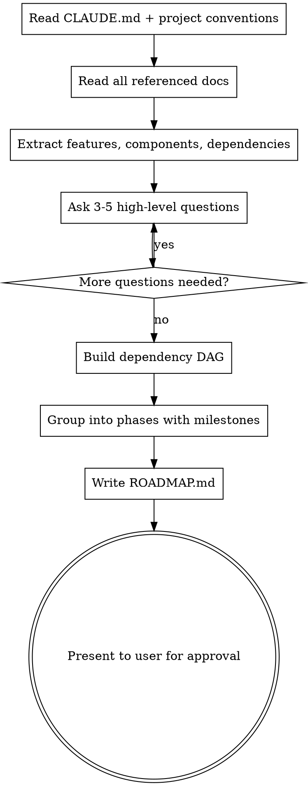

# Generate Roadmap

## Overview

Reads project documents and conventions, asks high-level clarifying questions, then produces a `ROADMAP.md` with dependency-aware phases. Designed to be consumed by the `execute-roadmap` skill.

## When to Use

- User asks to generate a roadmap or project plan
- User provides design docs, architecture docs, or specs and wants them broken into tasks
- User says "break this down" or "plan this project"

## Process



### Step 0 — Check for Existing ROADMAP.md

Before generating anything, check if `ROADMAP.md` already exists at the project root:
- **If it exists:** Ask the user: "A ROADMAP.md already exists. Should I: (a) overwrite it with a fresh plan, (b) extend it with new phases appended after existing ones, or (c) merge — review what's done and regenerate only incomplete phases?"
- If extending or merging, read the existing roadmap first. Preserve all `DONE` phases as collapsed summaries. Reuse existing task IDs and continue numbering from the highest existing ID.
- If overwriting, proceed normally but warn the user that the old roadmap will be replaced.

### Step 1 — Read Project Conventions

Before anything else:
- Read `CLAUDE.md` if it exists — extract tech stack, coding standards, naming conventions, preferred libraries
- Check for existing config files (`package.json`, `Cargo.toml`, `pyproject.toml`, etc.) to detect tech stack
- Note any conventions that agents must follow during execution

### Step 2 — Document Analysis

Read all provided/referenced documents. Extract:
- Feature areas and components
- Technical work items (infra, CI, testing)
- Existing priority signals (P0/P1/P2, "must have", "v1 vs v1.1")
- Dependencies between work items (what must exist before something else can be built)
- External blockers (design assets, API keys, third-party services, manual setup steps)

**Existing codebase:** If code already exists, read key files and directories to understand what's already built. Mark any already-implemented work as `DONE` in the roadmap. The roadmap should build on what exists, not duplicate it.

### Step 3 — High-Level Questions

Ask 3-5 questions. **Batch the first 3 together**, then follow up only if needed. Skip any already answered by the docs or conversation.

**Question bank (pick the most relevant):**

1. "What does a working MVP look like? I'll optimize the phase order so you get there fastest."
2. "Any features to defer or cut entirely from this roadmap?"
3. "Any tasks not in the docs? (CI/CD, testing infra, design assets, deployment, etc.)"
4. "I've identified these dependencies — anything wrong or missing?" *(present the dependency list)*
5. "Are there any external blockers — design assets, API keys, services, or manual setup needed before certain tasks can start?"
6. "Should tests be part of each task's acceptance criteria, or do you want separate testing tasks?"

### Step 4 — Build Phases and Generate

1. Build a dependency DAG from the extracted tasks
2. **Prioritize the path to MVP:** Identify the shortest chain of tasks that produces a working end-to-end flow. These tasks are P0 and land in the earliest phases. Everything else supports or extends that path.
3. Topologically sort into phases: tasks with no unmet dependencies go in the earliest possible phase. Let the dependency structure determine the number of tasks per phase — a phase with 2 tasks is fine if that's what the DAG produces. Do not pad phases to hit a target count.
4. Tasks within the same phase are independent and can run sequentially without conflicts
5. **Scope overlap check:** For each phase, verify no two tasks modify the same files or directories. If overlap is detected: (a) merge the tasks into one, (b) add a dependency between them so they land in different phases, or (c) split the overlapping file's concerns into separate scopes. This is critical — overlapping scopes in the same phase cause conflicts during parallel or sequential execution.
6. Mark milestone phases where the project reaches a demo-able state
7. Write `ROADMAP.md` at project root
8. Present to user for review before finalizing

## Output Format

The generated `ROADMAP.md` MUST follow this exact format:

```markdown
# Roadmap

> Phase-based with dependency tracking. Tasks within a phase are independent.
> Statuses: `TODO` | `IN PROGRESS` | `DONE`
> Priorities: `P0` (must have) | `P1` (should have) | `P2` (nice to have)
> Sizes: `[S]` (small) | `[M]` (medium) | `[L]` (large — consider splitting)
> Flags: `[SPIKE]` — needs investigation before implementation; `[BLOCKED: reason]` — waiting on external dependency
> Dependencies: `depends: #x, #y` — all must be complete before task starts
> Scope: `scope: path/` — relevant files/directories for the task (required)
> Acceptance: `AC:` — machine-verifiable criteria (indented below task)
> Milestones: `MILESTONE:` — marks demo-able project states
> Completed phases are collapsed to one-line summaries.

## Tech Stack
<!-- Auto-detected or user-specified -->
- Language: ...
- Framework: ...
- Key conventions: ...
- Build: `<build command>`
- Test: `<test command>`
- Lint: `<lint command>`
- Dev: `<dev server command>`

## Phase 1
- TODO [P0] [M] #1: First task description — scope: src/core/
  AC: build command exits 0; test command with core filter passes
- TODO [P0] [S] #2: Second task — scope: src/utils/
  AC: helper functions importable from src/core/; test command passes

## Phase 2 — MILESTONE: basic flow works end-to-end
- TODO [P0] [L] #3: Depends on phase 1 work — depends: #1 — scope: src/views/
  AC: view renders with sample data; no errors in dev console
- TODO [P1] [M] #4: Another task — depends: #2 — scope: src/api/
  AC: integration tests pass; endpoint returns expected JSON

## Phase 3
- TODO [P0] [SPIKE] [M] #5: Investigate auth approach — scope: docs/
  AC: decision documented in docs/; proof-of-concept code compiles
- TODO [P0] [M] #6: Depends on multiple — depends: #3, #4 — scope: src/app/
  AC: build exits 0; end-to-end flow works from input to output
```

**Format rules:**
- Each task: `- STATUS [PRIORITY] [SIZE] #ID: Description — scope: path/` with optional `— depends: #x, #y`
- `scope:` is **required** on every task — point to relevant files/directories. This saves agents significant exploration time.
- Each task has an `AC:` line (indented below) with 1-2 **machine-verifiable** acceptance criteria. Every AC must be checkable by running a command (build, test, lint, curl, visual check). Reference the commands from `## Tech Stack` rather than hardcoding tool-specific commands (e.g., say "build exits 0" not "npm run build exits 0" — the executor reads the actual command from Tech Stack). If it can't be checked by a command, rephrase it.
- `[SPIKE]` flag marks tasks that need investigation before implementation. These get a research-only agent first, then the task is re-scoped based on findings.
- `[BLOCKED: reason]` flag marks tasks waiting on something external (design assets, API keys, third-party service setup, manual configuration). Blocked tasks are skipped during execution until the blocker is resolved. Include what's needed and who can unblock it.
- Sizes: `[S]` (small, few hours), `[M]` (medium, a day), `[L]` (large, multi-day — consider splitting)
- Task IDs are sequential integers starting at #1
- **Prioritize path to MVP:** P0 = on the critical path to a working end-to-end flow or blocks other tasks. P1 = important but not on the critical path. P2 = enhancement or nice-to-have. When in doubt, ask: "does the MVP work without this?" If yes, it's not P0.
- Phases are ordered by dependency (phase N has no deps on phase N+1 or later)
- All tasks within a phase are independent of each other
- Let the dependency DAG determine phase sizes — don't pad phases to hit a count target. A phase with 2 tasks is fine. Small projects may have 10 total tasks; large ones 80+.
- Dependencies reference task IDs, not phase numbers
- Add `MILESTONE:` to phase headers where the project reaches a demo-able or testable state
- Tests are part of each task's AC (not separate tasks), but testing infrastructure setup (test runner, CI) should be an explicit task in Phase 1 if needed
- Include a `## Tech Stack` section at the top summarizing the detected/chosen stack and key conventions

## Completed Phase Format

When phases are marked done (by execute-roadmap or manually):

```markdown
## Phase 1 — DONE
Brief summary of what was built (N/N tasks)
```

This collapses completed work to one line, saving context for the orchestrator.

## Task Boundaries

A good task produces a **testable increment** — it adds something you can verify works in isolation. Ask: "can an agent implement this, run a command, and confirm it works without touching anything else?" If yes, it's the right size. If the task requires coordinating changes across unrelated subsystems, split it. If verifying it requires another task to be done first, add that dependency explicitly.

## Common Mistakes

- **Too granular:** "Create file X" is too small. "Implement column view with virtualization" is right.
- **Too coarse:** "Build the frontend" is too big. Break into component-level chunks.
- **Missing infra tasks:** Don't forget project scaffolding, CI, testing setup, build config.
- **Circular dependencies:** If A depends on B and B depends on A, they must be in the same task or one dependency is wrong.
- **Independent tasks in different phases:** If two tasks have no dependency relationship, they belong in the same phase.
- **No re-planning escape hatch:** If `execute-roadmap` discovers a task is mis-scoped or dependencies are wrong, it should pause and regenerate affected phases. Design tasks to be independently verifiable so this is rare.
- **Missing scope:** Every task should have a `scope:` hint. Without it, agents waste time exploring the codebase.
- **Non-verifiable AC:** "Code is clean" or "well-structured" can't be checked by a command. Use "builds without errors", "tests pass", "endpoint returns 200" instead.
- **Overlapping scopes in same phase:** If two tasks in the same phase modify the same files, they'll conflict when run sequentially. Either merge them into one task or add a dependency so they're in different phases.
- **Missing external blockers:** Tasks that need design assets, API keys, third-party services, or manual setup should be flagged `[BLOCKED: reason]`. Without this, agents will fail silently when they hit the missing dependency.
- **Padding phases to a target count:** Let the dependency DAG drive phase structure. Don't group unrelated tasks just to fill a phase, and don't split naturally related work across phases just because a phase feels too big.
