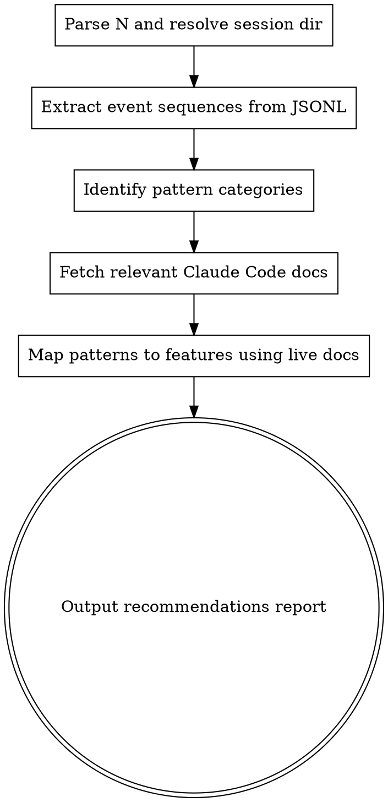

# Analyze Sessions

## Overview

Reads the last N session JSONL files for the current project, extracts tool-call sequences and interaction patterns, then maps repeated behaviors to concrete Claude Code features the user isn't fully utilizing. Fetches the actual Claude Code documentation at runtime so recommendations are always grounded in current feature specs.

## When to Use

- User asks to "analyze my last N sessions"
- User wants to find repeated patterns, automation opportunities, or underutilized features
- User asks "what should I automate?" or "what workflows am I repeating?"

## Process



### Step 1 — Parse Input and Resolve Session Directory

Extract the number N from the user's request (default to 10 if not specified — more data means better pattern detection).

The session directory is at `~/.claude/projects/<encoded-cwd>/` where `<encoded-cwd>` is the current working directory with path separators replaced by `--` and colons removed. For example:
- `C:\Users\honsf\DEVELOP\shutters` → `C--Users-honsf-DEVELOP-shutters`

Run:

```bash
SESSION_DIR=~/.claude/projects/$(pwd | sed 's|/|--|g' | sed 's|^-*||')
ls -lt "$SESSION_DIR"/*.jsonl 2>/dev/null | head -<N>
```

If the user specifies a different project path, resolve that instead.

### Step 2 — Extract Event Sequences and Prompt Themes

Run this Python script via Bash, passing the N session file paths as arguments. It extracts tool sequences, user prompt text, bash commands, and structural patterns.

```python
import json, sys, os, re
from collections import Counter

def parse_session(filepath):
    events = []       # ordered list of event symbols
    prompts = []      # user prompt texts
    tool_args = {}    # tool_name -> list of key arg snippets
    chains = []       # uninterrupted tool chains between user prompts
    current_chain = []
    stats = {"user_prompts": 0, "tool_calls": 0, "assistant_turns": 0,
             "first_ts": None, "last_ts": None, "stop_reasons": {},
             "models": set(), "has_agents": False, "has_skills": False,
             "permission_mode": None}

    with open(filepath, 'r', encoding='utf-8') as f:
        for line in f:
            try:
                obj = json.loads(line.strip())
            except (json.JSONDecodeError, ValueError):
                continue

            ts = obj.get("timestamp")
            if ts:
                if not stats["first_ts"]: stats["first_ts"] = ts
                stats["last_ts"] = ts

            if not stats["permission_mode"] and obj.get("permissionMode"):
                stats["permission_mode"] = obj["permissionMode"]

            t = obj.get("type")

            if t == "assistant":
                stats["assistant_turns"] += 1
                msg = obj.get("message", {})
                model = msg.get("model", "")
                if model: stats["models"].add(model)
                sr = msg.get("stop_reason")
                if sr: stats["stop_reasons"][sr] = stats["stop_reasons"].get(sr, 0) + 1
                content = msg.get("content", [])
                if isinstance(content, list):
                    for block in content:
                        if isinstance(block, dict) and block.get("type") == "tool_use":
                            name = block.get("name", "unknown")
                            sym = f"T:{name}"
                            events.append(sym)
                            current_chain.append(sym)
                            stats["tool_calls"] += 1
                            if name == "Agent": stats["has_agents"] = True
                            if name == "Skill": stats["has_skills"] = True
                            inp = block.get("input", {})
                            if name == "Bash":
                                cmd = inp.get("command", "")[:120]
                                tool_args.setdefault("Bash", []).append(cmd)
                            elif name == "Agent":
                                desc = inp.get("description", "")
                                sa_type = inp.get("subagent_type", "")
                                tool_args.setdefault("Agent", []).append(f"{sa_type}:{desc}")
                            elif name == "Skill":
                                skill_name = inp.get("skill", "")
                                tool_args.setdefault("Skill", []).append(skill_name)
                            elif name in ("Read", "Write", "Edit"):
                                fp = inp.get("file_path", "")
                                tool_args.setdefault(name, []).append(fp)
                            elif name in ("Glob", "Grep"):
                                pat = inp.get("pattern", "")
                                tool_args.setdefault(name, []).append(pat)
                            elif name == "WebFetch":
                                url = inp.get("url", "")
                                tool_args.setdefault("WebFetch", []).append(url)
                            elif name == "TodoWrite":
                                tool_args.setdefault("TodoWrite", []).append("used")
                            elif name.startswith("mcp__"):
                                tool_args.setdefault("MCP", []).append(name)

            elif t == "user":
                msg = obj.get("message", {})
                content = msg.get("content")
                if isinstance(content, str):
                    events.append("U")
                    prompts.append(content[:300])
                    stats["user_prompts"] += 1
                    if current_chain:
                        chains.append(current_chain)
                        current_chain = []
                elif isinstance(content, list):
                    has_tool_result = any(
                        isinstance(b, dict) and b.get("type") == "tool_result"
                        for b in content
                    )
                    if not has_tool_result:
                        events.append("U")
                        stats["user_prompts"] += 1
                        for b in content:
                            if isinstance(b, dict) and b.get("type") == "text":
                                prompts.append(b.get("text", "")[:300])
                        if current_chain:
                            chains.append(current_chain)
                            current_chain = []

    if current_chain:
        chains.append(current_chain)

    stats["models"] = list(stats["models"])
    return events, prompts, tool_args, chains, stats


def extract_ngrams(events, n):
    return [tuple(events[i:i+n]) for i in range(len(events) - n + 1)]


# --- Main ---
files = sys.argv[1:]
all_sessions = []

for fp in files:
    events, prompts, tool_args, chains, stats = parse_session(fp)
    all_sessions.append({
        "file": os.path.basename(fp),
        "events": events, "prompts": prompts,
        "tool_args": tool_args, "chains": chains, "stats": stats
    })

# === PER-SESSION SUMMARY ===
print("=" * 60)
print("PER-SESSION SUMMARY")
print("=" * 60)
for s in all_sessions:
    st = s["stats"]
    print(f"\n--- {s['file'][:36]}... ---")
    print(f"  Period: {(st['first_ts'] or '?')[:19]} -> {(st['last_ts'] or '?')[:19]}")
    print(f"  Prompts: {st['user_prompts']}  Tools: {st['tool_calls']}  Turns: {st['assistant_turns']}")
    print(f"  Agents used: {st['has_agents']}  Skills used: {st['has_skills']}  Mode: {st['permission_mode']}")
    print(f"  Models: {', '.join(st['models'])}")
    print(f"  Chains: {len(s['chains'])}  Avg chain len: {sum(len(c) for c in s['chains']) / max(len(s['chains']),1):.1f}")

# === REPEATED SEQUENCES (n-grams) ===
print("\n" + "=" * 60)
print("REPEATED SEQUENCES")
print("=" * 60)
for n in [2, 3, 4, 5, 6]:
    all_ngrams = Counter()
    ngram_sessions = {}
    for idx, s in enumerate(all_sessions):
        seen_in_session = set()
        for ng in extract_ngrams(s["events"], n):
            all_ngrams[ng] += 1
            seen_in_session.add(ng)
        for ng in seen_in_session:
            ngram_sessions.setdefault(ng, set()).add(idx)

    frequent = [(ng, c) for ng, c in all_ngrams.most_common(100) if c >= 3]
    if frequent:
        print(f"\n--- {n}-grams (seen 3+ times) ---")
        for ng, count in frequent[:12]:
            sess_count = len(ngram_sessions.get(ng, set()))
            print(f"  {' -> '.join(ng)}  (x{count}, {sess_count}/{len(all_sessions)} sessions)")

# === STRUCTURAL PATTERNS ===
print("\n" + "=" * 60)
print("STRUCTURAL PATTERNS")
print("=" * 60)

retry_tools = Counter()
for s in all_sessions:
    for chain in s["chains"]:
        for i in range(len(chain) - 2):
            if chain[i] == chain[i+1] == chain[i+2]:
                retry_tools[chain[i]] += 1
if retry_tools:
    print("\nRetry loops (same tool 3+ in a row):")
    for tool, count in retry_tools.most_common(10):
        print(f"  {tool} x3+ appeared {count} times")

search_tools = {"T:Read", "T:Glob", "T:Grep", "T:Agent"}
edit_tools = {"T:Edit", "T:Write"}
long_explore = 0
for s in all_sessions:
    for chain in s["chains"]:
        run = 0
        for sym in chain:
            if sym in search_tools:
                run += 1
            elif sym in edit_tools:
                if run >= 5: long_explore += 1
                run = 0
            else:
                run = 0
        if run >= 5: long_explore += 1
print(f"\nLong exploration runs (5+ search tools before edit/end): {long_explore}")

total_chains = sum(len(s["chains"]) for s in all_sessions)
long_chains = sum(1 for s in all_sessions for c in s["chains"] if len(c) >= 5)
print(f"Total tool chains: {total_chains}")
print(f"Long chains (5+ tools uninterrupted): {long_chains} ({100*long_chains/max(total_chains,1):.0f}%)")

avg_chain = sum(len(c) for s in all_sessions for c in s["chains"]) / max(total_chains, 1)
print(f"Average chain length: {avg_chain:.1f} tools between user prompts")

print("\nSession styles:")
for s in all_sessions:
    st = s["stats"]
    ratio = st["tool_calls"] / max(st["user_prompts"], 1)
    style = "autonomous" if ratio > 10 else "interactive" if ratio < 3 else "mixed"
    print(f"  {s['file'][:20]}... -> {style} (ratio: {ratio:.1f} tools/prompt)")

# === TOOL FREQUENCY ===
print("\n" + "=" * 60)
print("TOOL FREQUENCY")
print("=" * 60)
tool_counts = Counter()
for s in all_sessions:
    for e in s["events"]:
        if e.startswith("T:"):
            tool_counts[e[2:]] += 1
total_tools = sum(tool_counts.values())
for tool, count in tool_counts.most_common(20):
    print(f"  {tool}: {count} ({100*count/max(total_tools,1):.0f}%)")

# === BASH COMMAND PATTERNS ===
print("\n" + "=" * 60)
print("BASH COMMAND PATTERNS")
print("=" * 60)
all_cmds = []
for s in all_sessions:
    all_cmds.extend(s["tool_args"].get("Bash", []))
cmd_prefixes = Counter()
for cmd in all_cmds:
    words = cmd.strip().split()
    if words:
        prefix = words[0]
        if len(words) > 1 and not words[1].startswith("-"):
            prefix = f"{words[0]} {words[1]}"
        cmd_prefixes[prefix] += 1
for prefix, count in cmd_prefixes.most_common(15):
    print(f"  {prefix}: {count}")

# === USER PROMPT THEMES ===
print("\n" + "=" * 60)
print("USER PROMPT THEMES (first 80 chars)")
print("=" * 60)
all_prompts = []
for s in all_sessions:
    all_prompts.extend(s["prompts"])
seen = set()
for p in all_prompts:
    key = p[:60].lower().strip()
    if key not in seen and len(key) > 5:
        seen.add(key)
        print(f"  * {p[:100]}")
    if len(seen) >= 30:
        break

# === FEATURE USAGE SIGNALS ===
print("\n" + "=" * 60)
print("FEATURE USAGE SIGNALS")
print("=" * 60)
has_agent = any(s["stats"]["has_agents"] for s in all_sessions)
has_skill = any(s["stats"]["has_skills"] for s in all_sessions)
has_todo = any("T:TodoWrite" in s["events"] for s in all_sessions)
has_mcp = any(s["tool_args"].get("MCP") for s in all_sessions)
has_webfetch = any(s["tool_args"].get("WebFetch") for s in all_sessions)
has_memory_write = any("memory" in str(s["tool_args"].get("Write", [])).lower() for s in all_sessions)
bash_cmds_flat = " ".join(all_cmds).lower()
has_git_ops = "git " in bash_cmds_flat
has_test_runs = any(kw in bash_cmds_flat for kw in ["npm test", "pytest", "vitest", "jest", "cargo test", "bun test"])
has_worktree = "worktree" in bash_cmds_flat
permission_modes = set(s["stats"]["permission_mode"] for s in all_sessions if s["stats"]["permission_mode"])

agent_types = Counter()
for s in all_sessions:
    for desc in s["tool_args"].get("Agent", []):
        agent_type = desc.split(":")[0] if ":" in desc else "general-purpose"
        agent_types[agent_type] += 1

skill_names = Counter()
for s in all_sessions:
    for name in s["tool_args"].get("Skill", []):
        skill_names[name] += 1

mcp_tools = Counter()
for s in all_sessions:
    for name in s["tool_args"].get("MCP", []):
        mcp_tools[name] += 1

file_reads = Counter()
for s in all_sessions:
    session_files = set(s["tool_args"].get("Read", []))
    for f in session_files:
        file_reads[f] += 1
repeated_reads = [(f, c) for f, c in file_reads.most_common(20) if c >= 3]

print(f"  Agent tool used: {has_agent}")
if agent_types:
    print(f"    Agent subtypes: {dict(agent_types.most_common(10))}")
print(f"  Skill tool used: {has_skill}")
if skill_names:
    print(f"    Skills invoked: {dict(skill_names.most_common(10))}")
print(f"  MCP tools used: {has_mcp}")
if mcp_tools:
    print(f"    MCP tools: {dict(mcp_tools.most_common(10))}")
print(f"  TodoWrite used: {has_todo}")
print(f"  WebFetch used: {has_webfetch}")
print(f"  Memory writes: {has_memory_write}")
print(f"  Git operations: {has_git_ops}")
print(f"  Test runs: {has_test_runs}")
print(f"  Worktree usage: {has_worktree}")
print(f"  Permission modes: {permission_modes}")
if repeated_reads:
    print(f"  Files read in 3+ sessions:")
    for f, c in repeated_reads:
        print(f"    {f}: {c} sessions")
print(f"  Total sessions: {len(all_sessions)}")
print(f"  Total prompts: {sum(s['stats']['user_prompts'] for s in all_sessions)}")
print(f"  Total tool calls: {sum(s['stats']['tool_calls'] for s in all_sessions)}")
```

Run this script via Bash, passing the N most-recent session file paths as arguments. Use a generous timeout (120s) since large sessions take time to parse.

### Step 3 — Fetch Relevant Documentation

Based on the patterns found in Step 2, fetch **only the docs pages that are relevant** to the patterns you actually detected. Do not fetch pages for features that have no signal in the data.

The Claude Code docs live at `https://code.claude.com/docs/en/<page>`. Use WebFetch to pull the specific pages you need. Fetch them **in parallel** where possible.

Use this mapping to decide which pages to fetch:

| Pattern detected | Fetch this page | What to extract |
|---|---|---|
| Repeated tool sequences across sessions | `skills` | Skill creation: frontmatter fields, `$ARGUMENTS`, `context: fork`, `paths:`, dynamic injection with `` !`cmd` `` |
| Repeated Bash commands, or manual post-edit steps | `hooks` | Hook events, matcher syntax, `if` field, input/output schemas, exit code 2 blocking |
| Long exploration / same files read repeatedly | `memory` | CLAUDE.md, `@imports`, `.claude/rules/`, auto memory, path-specific rules |
| Agent tool used but only built-in types | `sub-agents` | Custom agent creation, frontmatter fields, `memory`, `skills` preloading, `isolation: worktree` |
| Multi-file parallel work or large-scale changes | `agent-teams` | Team creation, task coordination, teammate roles, when to use vs subagents |
| Status polling, repeated checks, periodic tasks | `scheduled-tasks` | `/loop` syntax, CronCreate, cloud vs desktop vs session-scoped |
| Manual git operations | `common-workflows` | Git worktree workflows, `/batch`, plan mode |
| External service interaction via Bash/WebFetch | `mcp` | MCP server configuration, available integrations |
| Frequent permission prompts / re-steering | `permissions` + `permission-modes` | Permission rules, auto mode, plan mode |
| Push notifications or external event needs | `channels` | Channel setup, webhook receivers |

For each page you fetch, ask WebFetch to extract:
- The feature's exact configuration format (frontmatter fields, JSON schema, CLI flags)
- Concrete examples from the docs
- Constraints and limitations

**Example WebFetch calls:**

```
WebFetch(url="https://code.claude.com/docs/en/skills", prompt="Extract: all SKILL.md frontmatter fields and their types, string substitution variables, how to create a skill with a slash command, the context:fork pattern for subagent execution, dynamic injection with !`cmd`, and the bundled skills list. Include concrete examples.")

WebFetch(url="https://code.claude.com/docs/en/hooks", prompt="Extract: all 26 hook event names and when they fire, the JSON configuration schema, matcher syntax, the if field for conditional hooks, how PreToolUse can block/allow/modify tool calls, how PostToolUse can inject additionalContext, exit code 2 behavior per event, and the environment variables available. Include concrete examples.")
```

**Only fetch what you need.** If the session data shows no signals for hooks, don't fetch the hooks page. If there's no MCP usage pattern, skip the MCP page. Typically you'll fetch 2-4 pages, not all of them.

### Step 4 — Check Existing Configuration

Before recommending, check what the user's project already has:

```bash
ls .claude/skills/ .claude/agents/ .claude/rules/ 2>/dev/null
ls ~/.claude/skills/ ~/.claude/agents/ ~/.claude/rules/ 2>/dev/null
cat .claude/settings.json 2>/dev/null | head -50
cat ~/.claude/settings.local.json 2>/dev/null | head -50
cat ~/.claude/settings.json 2>/dev/null | head -50
```

If a recommendation overlaps with an existing skill/hook/agent, reframe it as "you have X but aren't invoking it" rather than "build X."

### Step 5 — Map Patterns to Features Using Live Docs

Now combine the session analysis (Step 2) with the live documentation (Step 3) to produce recommendations. For each detected pattern:

1. Identify which Claude Code feature best addresses it
2. Use the **actual configuration format from the fetched docs** — not guesses
3. Write a concrete implementation: file path, frontmatter, JSON config
4. Score by: Frequency (how often the pattern appears) × Time saved (per occurrence) / Effort (to implement)

**Key decision rules:**
- Repeated tool sequences → **Skill** (a reusable workflow triggered by `/name`)
- Repeated shell commands or post-edit steps → **Hook** (automatic, event-driven)
- Same user prompt across sessions → **Slash command** (one keystroke)
- Same files read every session → **CLAUDE.md `@import`** or **`.claude/rules/`** (pre-loaded context)
- Exploration without action → **Auto memory** or **custom subagent with `memory:`** (persistent learning)
- Retry loops → **PreToolUse hook** (validate before execution) or **skill** (encode correct approach)
- Frequent re-steering → **Plan mode** (structured planning before execution)
- Manual git/test operations → **PostToolUse hook** or **Stop hook** (automatic triggers)
- Status polling → **`/loop`** (recurring prompt on interval)
- No agent usage on multi-file work → **Custom subagents** (delegate exploration/implementation)

### Step 6 — Output Recommendations Report

Present the analysis in this format:

```markdown
## Session Analysis: Last N Sessions

**Period:** <earliest date> → <latest date>  |  **Sessions:** N  |  **Prompts:** X  |  **Tool calls:** Y

---

### Repeated Workflows → Automation Opportunities

(Ranked by impact score. Up to 8 recommendations, quality over quantity.)

#### 1. <Short name for the pattern>

**What I found:** <1-2 sentences describing the repeated pattern with specific counts and session spread>

**Evidence:**
- <specific n-gram, count, session spread>
- <specific bash command or prompt theme>

**Recommended feature:** <Feature name> (docs: https://code.claude.com/docs/en/<page>)

**How to implement:**
<Concrete instructions using the actual configuration format from the fetched docs. File paths, frontmatter, JSON. Specific enough that the user can say "do it.">

**Impact:** Frequency: N/5 | Time saved: N/5 | Effort: N/5 | **Score: N**

---

(Repeat for each opportunity)

### Session Profile

| Metric | Value | Interpretation |
|--------|-------|----------------|
| Autonomy ratio | X tools/prompt | <high = good delegation, low = micromanaging> |
| Avg chain length | N | <short = frequent steering, long = autonomous runs> |
| Agent usage | Y% of sessions | <low + multi-file work = delegation opportunity> |
| Retry rate | Z loops detected | <high = error-prone areas need guardrails> |
| Session style | interactive / mixed / autonomous | overall characterization |

### Underutilized Features

Only list features where session data shows a concrete signal. Skip features with no evidence.

| Feature | Current usage | What the data suggests |
|---------|---------------|------------------------|
| <feature> | <current state> | <specific recommendation tied to data> |
```

## Important Notes

- Only analyze sessions for the **current project** directory unless the user specifies otherwise
- Session files are at `~/.claude/projects/<encoded-cwd>/` — encoding replaces `/` (or `\`) with `--` and strips leading separators
- Each `.jsonl` file is one session; sort by file modification time to get the most recent N
- Skip subagent JSONL files (inside `<uuid>/subagents/` subdirectories) ��� only read top-level `.jsonl` files
- If N is larger than available sessions, analyze all available and note the actual count
- **Fetch docs dynamically** — do NOT rely on memorized feature specs. Always WebFetch the relevant pages so recommendations use current configuration formats
- **Only fetch docs pages that match detected patterns** — don't load the entire docs site
- **Every recommendation must include concrete implementation** using the configuration format from the fetched docs
- **Don't recommend features that have no signal in the data**
- **Check existing configuration first** — don't suggest building what already exists
