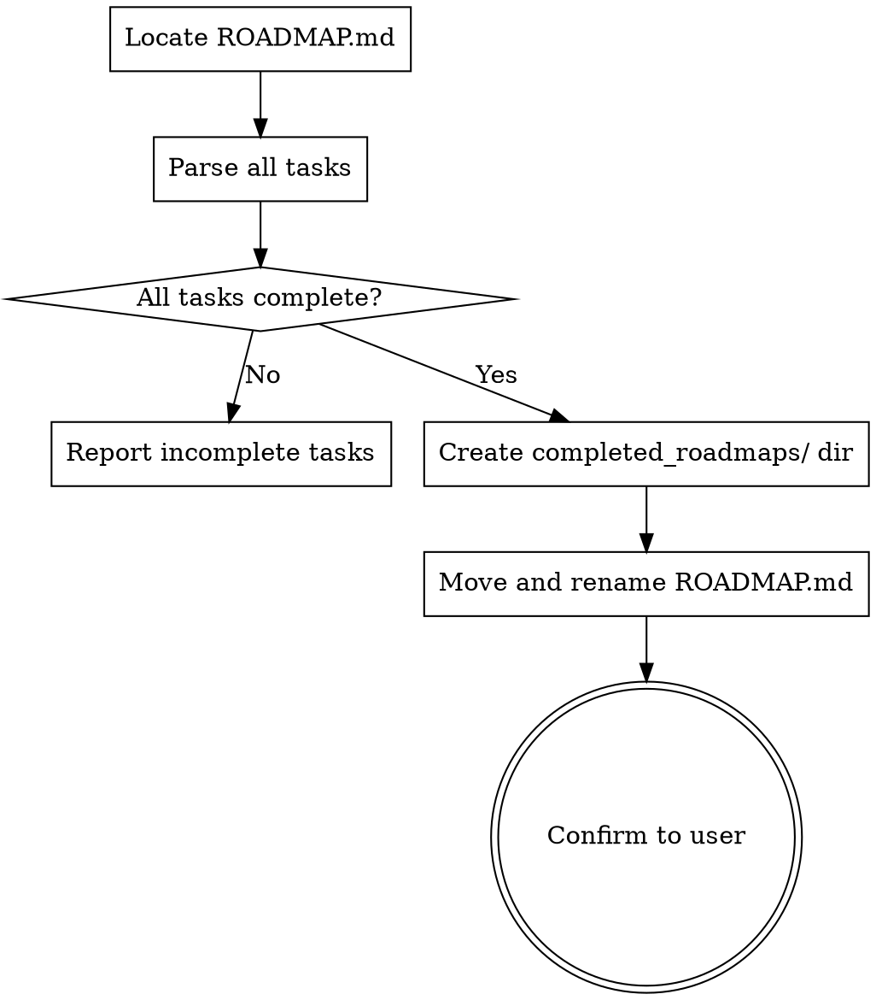

# Archive Roadmap

## Overview

Checks whether every task in `ROADMAP.md` is complete. If all tasks are done, moves the roadmap into `completed_roadmaps/` at the root of the repo it belongs to, timestamped for reference.

## When to Use

- User asks to archive a roadmap
- User asks to check if a roadmap is complete and clean it up
- User says "archive roadmap", "roadmap done?", or "move completed roadmap"

## Process



## Step-by-Step

### Step 1 — Locate the roadmap

Find `ROADMAP.md` in the current working directory. If not found, check one level up. If still not found, ask the user for the path.

### Step 2 — Identify the repo root

Determine the git repository root that contains the `ROADMAP.md`. This is where `completed_roadmaps/` will be created. Run:

```bash
git -C <roadmap-dir> rev-parse --show-toplevel
```

### Step 3 — Parse all tasks

Read `ROADMAP.md` and extract every task line. Tasks follow the roadmap format:

- Lines matching `- TODO [P*]` → incomplete
- Lines matching `- DONE [P*]` → complete
- Lines matching `- SKIP [P*]` → complete (skipped counts as resolved)
- Lines matching `- IN PROGRESS [P*]` → incomplete
- Phase headers ending with `— DONE` → collapsed/complete phases (all tasks within are done)

A phase marked `— DONE` in its header counts all its original tasks as complete, even if individual task lines are collapsed into a summary.

### Step 4 — Evaluate completeness

Count total tasks and completed tasks. The roadmap is **complete** if and only if:

- Every task is `DONE` or `SKIP`
- No task is `TODO` or `IN PROGRESS`
- Zero uncollapsed incomplete phases remain

### Step 5 — If incomplete, report and stop

If any tasks remain incomplete, report to the user:

```
Roadmap is not complete yet.

Remaining tasks:
- [Phase N] #id: description (TODO)
- [Phase N] #id: description (IN PROGRESS)

X of Y tasks complete.
```

Do **not** move the file. Stop here.

### Step 6 — If complete, archive

1. Create `completed_roadmaps/` directory at the repo root if it doesn't exist:

```bash
mkdir -p <repo-root>/completed_roadmaps
```

2. Generate a filename using the current date and the project name (derived from the directory name or the roadmap's title heading):

```
ROADMAP_<project-name>_<YYYY-MM-DD>.md
```

For example: `ROADMAP_typleands-v1_2026-03-20.md`

3. If a file with that name already exists, append a numeric suffix: `_2`, `_3`, etc.

4. Move the file:

```bash
mv <roadmap-path>/ROADMAP.md <repo-root>/completed_roadmaps/ROADMAP_<project-name>_<date>.md
```

### Step 7 — Confirm to user

Report the result:

```
Roadmap complete! All X tasks done.
Archived to: completed_roadmaps/ROADMAP_<project-name>_<date>.md
```

If there's a `.gitignore` that would exclude the directory, mention it so the user can decide whether to track archived roadmaps in git.

## Common Mistakes to Avoid

1. **Don't archive incomplete roadmaps** — the whole point is the completeness check. Never move a roadmap that has remaining work.
2. **Don't delete the roadmap** — this is a *move*, not a delete. The file must end up in `completed_roadmaps/`.
3. **Don't confuse collapsed phases with incomplete phases** — a phase header ending in `— DONE` means all tasks in that phase are complete, even though individual task lines may have been replaced with a summary.
4. **Don't create `completed_roadmaps/` outside the repo root** — always anchor to the git repo root of the roadmap's project.
5. **Don't overwrite existing archives** — use numeric suffixes to avoid collisions.
