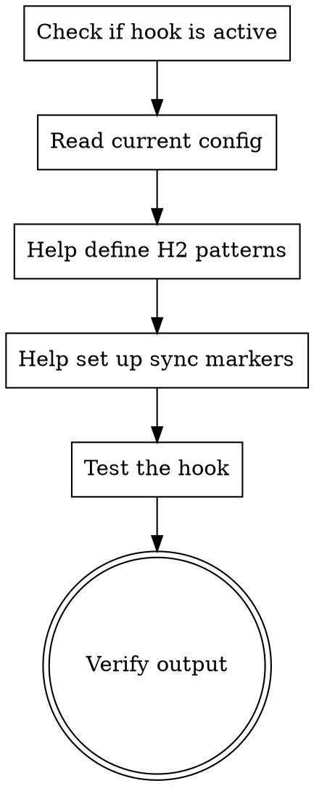

# Doc Refactor Hook

## Overview

Configures the automatic CLAUDE.md refactoring Stop hook. When active, every time a Claude Code session stops, the hook checks if CLAUDE.md changed and automatically:

1. **Splits H2 sections** into individual `.claude/rules/*.md` files based on pattern matching
2. **Syncs tagged sections** into external docs (README, CONTRIBUTING, etc.) between marker comments
3. **Deduplicates** — removes consecutive duplicate lines, repeated bullets, and collapses excessive whitespace

The hook is part of the vibecoding plugin and fires automatically. This skill helps configure _which_ sections get split and _where_ they sync to.

## When to Use

- User asks to set up doc refactoring or CLAUDE.md splitting
- User wants CLAUDE.md sections extracted into `.claude/rules/`
- User asks about syncing CLAUDE.md content to README or other docs
- User says "configure doc refactor", "set up rules splitting", "split CLAUDE.md into rules"
- User wants to customize which H2 headings map to which rule files

## Process



## Step-by-Step

### Step 1 — Check if the hook is active

The hook is registered via the vibecoding plugin's `hooks/hooks.json`. Verify the plugin is installed:

```bash
# Check if vibecoding plugin is listed
ls ~/.claude/plugins/marketplaces/*/plugins/vibecoding/ 2>/dev/null || echo "Plugin not installed"
```

If not installed, the user needs to install the vibecoding plugin first.

### Step 2 — Read current configuration

The hook uses a JSON config file. It checks two locations in order:

1. **Project-local override**: `doc-refactor-config.json` in the project root (takes priority)
2. **Bundled default**: `hooks/doc-refactor/config.json` in the plugin directory

Read the current config to show the user what's configured:

```bash
cat doc-refactor-config.json 2>/dev/null || echo "No project-local config — using plugin defaults"
```

### Step 3 — Help define H2 pattern mappings

Create or edit `doc-refactor-config.json` at the project root. Each entry in `h2_to_rules` maps a regex pattern (matched against H2 heading text) to an output filename in `.claude/rules/`.

**Example config:**

```json
{
  "rules_dir": ".claude/rules",
  "hash_file": ".claude/.doc-refactor-hash",
  "h2_to_rules": [
    {
      "pattern": "^Common Tech Patterns$",
      "filename": "tech-patterns.md"
    },
    {
      "pattern": "^(Coding Standards|Code Style|Conventions)$",
      "filename": "coding-standards.md"
    },
    {
      "pattern": "^(Testing|Test).*$",
      "filename": "testing.md"
    }
  ],
  "sync_targets": []
}
```

**Guidelines for patterns:**

- Patterns use extended regex (ERE) syntax, matched with `grep -E`
- `^...$` anchors ensure exact heading matches
- Use `|` alternation for multiple heading names that should map to the same rule file
- Use `.*` suffix to match headings that start with a prefix (e.g., `^Build.*$` matches "Build", "Build & Deploy", "Build Pipeline")

Read the user's CLAUDE.md to identify H2 headings, then help them create appropriate mappings.

### Step 4 — Help set up sync markers in target files

For sections that should sync to external docs, the user needs:

1. A marker pair in CLAUDE.md around the source content:

```markdown
<!-- CLAUDE:project-table -->
| Project | Stack | Purpose |
|---------|-------|---------|
| **app** | React | Main UI |
<!-- /CLAUDE:project-table -->
```

2. The same marker pair in the target file (e.g., README.md) where content should be injected:

```markdown
## Projects

<!-- CLAUDE:project-table -->
This content will be replaced by the hook.
<!-- /CLAUDE:project-table -->
```

3. A `sync_targets` entry in the config:

```json
{
  "sync_targets": [
    {
      "tag": "project-table",
      "file": "README.md"
    }
  ]
}
```

The hook replaces everything between the markers in the target file with the content between the same markers in CLAUDE.md.

### Step 5 — Test the hook manually

To verify the hook works without waiting for a session stop:

```bash
# Simulate the hook with empty stdin (no stop_hook_active flag)
echo '{}' | bash <plugin-path>/hooks/doc-refactor/doc-refactor.sh
```

Or simply make a change to CLAUDE.md, start a Claude Code session, let it respond, and exit. The hook fires on stop.

### Step 6 — Verify generated files

After the hook runs, check:

```bash
# Rules files were created
ls -la .claude/rules/

# Hash file was updated
cat .claude/.doc-refactor-hash

# External docs were synced (if configured)
grep "CLAUDE:" README.md
```

## Guards & Safety

The hook has three layers of protection against infinite loops:

1. **`stop_hook_active` check**: If the Stop event JSON indicates this stop was triggered by a hook, the script exits immediately
2. **SHA-256 hash check**: The script stores a hash of CLAUDE.md after each run. If the file hasn't changed since the last run, it exits early
3. **Post-write hash update**: After modifying CLAUDE.md (deduplication), the script saves the new hash so its own edits don't trigger a re-run

## Common Mistakes to Avoid

1. **Don't forget to add markers to BOTH files** — sync requires `<!-- CLAUDE:tag -->` markers in both CLAUDE.md and the target file. Missing markers in either file means the sync is silently skipped.
2. **Don't use overlapping patterns** — if two patterns match the same H2 heading, only the first match writes. Keep patterns specific.
3. **Don't edit generated rule files by hand** — they'll be overwritten on the next hook run. Edit CLAUDE.md instead; it's the source of truth.
4. **Don't forget `jq` dependency** — the hook requires `jq` to parse JSON config and stdin. Install it if not present.
5. **Don't put the hash file in git** — add `.claude/.doc-refactor-hash` to `.gitignore` since it's machine-local state.
