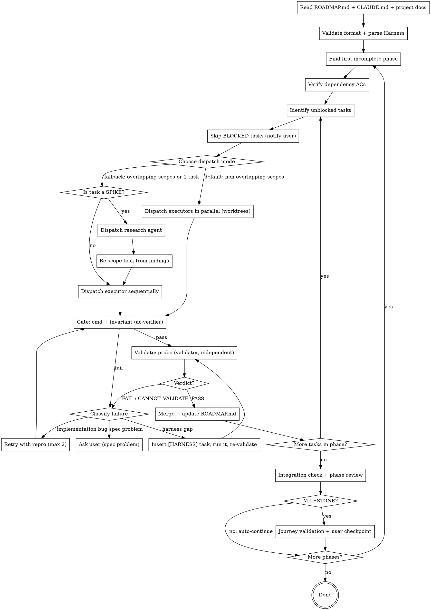

# Execute Roadmap

## Overview

Reads a `ROADMAP.md` (produced by `generate-roadmap`), then builds the project phase-by-phase directly on main. Independent tasks within a phase can run in parallel using git worktrees (merged into main on completion), or sequentially on the working tree. Completed phases are collapsed to save context.

**Humans steer, agents execute.** Each task is built by one agent and **independently validated by another** that boots the app and drives it, leaving evidence behind. When an agent fails, the first question is *what capability is missing?* Missing capabilities become `[HARNESS]` tasks rather than blind retries. The user is asked to look only at **milestones**, and they review evidence, not diffs. Background: `${CLAUDE_PLUGIN_ROOT}/docs/harness-engineering.md`.

## Reusable Agents

This skill dispatches the following named agents (defined in `agents/`). Address them with `@<name>` rather than inlining ad-hoc Task prompts. The agent files own the prompt contract, and using named agents keeps dispatch consistent across runs and between `execute-roadmap` and `auto-execute-roadmap`.

- `@phase-executor` — implements a single task in the current phase. One per task in parallel mode.
- `@spike-researcher` — read-only investigation for `[SPIKE]` tasks; returns refined scope and approach.
- `@ac-verifier` — the mechanical gate: runs `cmd:`/`invariant:` clauses and the Harness Build/Test/Lint/Invariants commands, plus a Boot→Ready smoke check at integration.
- `@validator` — independent behavioral validation: boots the app in the task's worktree, drives it to check `probe:` clauses (and milestone `JOURNEY:` lines), writes evidence, and returns `PASS` / `FAIL` / `CANNOT_VALIDATE`.
- `@phase-reviewer` — diff-based quality review of a completed phase, including validation gaps and promote-to-rule candidates.

All agents live in `${CLAUDE_PLUGIN_ROOT}/agents/`. See those files for the exact input contract each one expects.

## Plugin Options (read at runtime)

Users configure this plugin via `plugin.json` `userConfig`. Claude Code exports chosen values as env vars to this skill's subprocesses:

- `CLAUDE_PLUGIN_OPTION_PARALLELAGENTLIMIT` (number, default `4`) — cap on concurrent `@phase-executor` agents per phase.
- `CLAUDE_PLUGIN_OPTION_DEFAULTEFFORT` (string, default `medium`) — effort level passed to dispatched agents. `xhigh` requires an Opus model (`@phase-executor` and `@phase-reviewer` run on Opus 5.5).
- `CLAUDE_PLUGIN_OPTION_WORKTREEPARENTDIR` (string, default `..`) — parent directory for parallel worktrees.
- `CLAUDE_PLUGIN_OPTION_AUTOCOMMITONACPASS` (boolean, default `true`) — whether validated work is merged automatically.
- `CLAUDE_PLUGIN_OPTION_RUNPHASEREVIEWER` (boolean, default `true`) — whether to dispatch `@phase-reviewer` after each phase's integration check.
- `CLAUDE_PLUGIN_OPTION_VALIDATORBASEPORT` (number, default `4800`) — first port handed to app instances booted by executors and validators. Each concurrent instance gets its own pair (`base + 2 × slot`, and `+1`).

Respect these values when choosing parallelism, effort, ports, and post-phase actions. If env vars are not set, fall back to the documented defaults.

## When to Use

- User says "execute the roadmap", "start building", "work through the phases"
- A `ROADMAP.md` exists in the project root
- User wants to automate multi-phase implementation

## Process



### Step 1 — Read, Validate, and Parse

- Read `ROADMAP.md` from project root. **If it does not exist**, inform the user and suggest running `generate-roadmap` to create one. Do not proceed without a roadmap.
- Read `CLAUDE.md` if it exists. Extract coding conventions, tech stack, and standards that agents must follow.
- Read architecture/design docs referenced in the project.
- **Parse the Harness section:** extract Build, Test, Lint, Invariants, Boot, Ready, Driver, Observe, Reach. Legacy roadmaps call this section `## Tech Stack` and usually have only Build/Test/Lint/Dev. Treat `Dev` as `Boot` and leave the rest unset.
- **Evidence directory:** make sure `.vibecoding/` is listed in the project's `.gitignore` (add it and commit `chore: ignore vibecoding evidence` if it isn't). Evidence is local-only. Merge commits point at it.
- **Validate format:** check that every task has `scope:`, `AC:`, a priority, a size, and a sequential `#ID`. If any are missing, warn the user before proceeding.
- **Legacy migration (untyped AC):** if ACs aren't typed with `cmd:`/`probe:`/`invariant:`, or a task with user-visible behavior has no `probe:`, it can never reach `DONE`. Before the first dispatch, draft typed ACs for every remaining `TODO` task, and add Harness fields and `[HARNESS]` Phase 0 tasks where Boot/Ready/Observe are missing (same audit as `generate-roadmap` Step 2.5). Show the user the diff once, apply it on approval, and commit `roadmap: migrate to typed AC + harness`.
- Parse phases, task statuses, dependencies.
- Identify the first phase that is not `DONE`.

### Step 2 — Identify Unblocked Tasks

Within the current phase, find all tasks where:
- Status is `TODO` (skip `DONE` or `IN PROGRESS`)
- Task is NOT flagged `[BLOCKED: ...]`
- All `depends: #x` references point to tasks marked `DONE` or in a completed phase

**Handle BLOCKED tasks:** If any tasks in the phase have the `[BLOCKED: reason]` flag:
1. List all blocked tasks and their reasons to the user at the start of the phase
2. Ask: "These tasks are blocked — has anything changed?" For each:
   - If the user confirms the blocker is resolved: remove the `[BLOCKED]` flag and include the task in the dispatch queue
   - If still blocked: skip the task entirely — do not dispatch it. Continue with unblocked tasks.
3. If ALL tasks in a phase are blocked, pause and tell the user: "Phase N is entirely blocked. Resolve these blockers or adjust the roadmap before continuing." Do not proceed to the next phase — blocked tasks may be prerequisites for later phases.
4. At the end of a phase, if blocked tasks remain: report them again and ask whether to (a) wait, (b) skip and move on, or (c) re-plan.

Order unblocked tasks within the phase: `[HARNESS]` first, then P0, then P1, then P2.

### Step 3 — Handle SPIKE Tasks

If a task has the `[SPIKE]` flag:

1. Dispatch the `@spike-researcher` agent with the task id, description, scope, and any specific open questions that need to be resolved before implementation. The agent file (`agents/spike-researcher.md`) defines the full input contract and output format — don't duplicate those instructions inline.
2. Present the agent's findings to the user.
3. Update the task description, AC (typed), and size in ROADMAP.md based on the findings.
4. Remove the `[SPIKE]` flag and proceed to dispatch the implementation agent.

### Step 4 — Mark In Progress and Dispatch Agent

Before dispatching, mark the task as `IN PROGRESS` in ROADMAP.md and commit. This enables resumability if the session is interrupted.

**Choose dispatch mode** based on the phase:

#### Parallel Mode (default — worktrees)
Multiple agents run simultaneously in isolated git worktrees. **This is the default when conditions are met.** Use when:
- Tasks within the phase have **non-overlapping `scope:` values**
- The phase has 2+ independent tasks

Do NOT ask the user for permission — just dispatch in parallel and inform them: "Dispatching N tasks in parallel (non-overlapping scopes)." If the user has explicitly requested sequential execution, respect that.

#### Sequential Mode (fallback)
One agent at a time on the working tree. Use when:
- Tasks have overlapping scopes (even if in the same phase)
- The phase has only 1 task
- The user has explicitly requested sequential execution

**Parallel workflow:**
1. For each task, dispatch the `@phase-executor` agent with `isolation: "worktree"`. Cap concurrent agents at `CLAUDE_PLUGIN_OPTION_PARALLELAGENTLIMIT` (default 4) — queue any remaining tasks and dispatch them as earlier ones merge.
2. Each agent works in its own copy of the repo — no conflicts possible.
3. As each agent completes, run Step 5 (gate + validate) **in its worktree**, and merge only on `PASS`. Merge in completion order; don't wait for all agents to finish. Completion order is safe because scopes don't overlap.
4. If a merge conflict occurs (shouldn't with non-overlapping scopes, but possible): resolve it or fall back to sequential for the conflicting task.
5. After merging, **explicitly call `ExitWorktree`** to clean up the worktree directory and branch. Do not rely on automatic cleanup — always call `ExitWorktree` after the merge completes (or once a failed task's worktree is no longer needed).

**`@phase-executor` input contract:**

Pass these inputs when dispatching (the agent file `agents/phase-executor.md` documents the full contract):

- **Task**: `#{id}: {description}`
- **Acceptance criteria**: the typed `cmd:` / `probe:` / `invariant:` clauses, verbatim.
- **Scope**: `{scope from roadmap}`
- **Harness**: verbatim from the `## Harness` section of ROADMAP.md.
- **Port**: `CLAUDE_PLUGIN_OPTION_VALIDATORBASEPORT + 2 × slot` — a port pair reserved for this executor's self-probe.
- **Project conventions**: key points from CLAUDE.md (tech stack, naming, patterns).
- **Completed dependencies**: `depends:` task ids + one-line description of what each produced.
- **Phase context**: collapsed summaries of prior completed phases (Built / Patterns / Key files).
- **Task type hint**: `harness` (for `[HARNESS]` tasks) | `infra` | `ui` | `api` | `test` | omit for general.
- **Prior attempt** (retries only): the gate's failing output or the validator's repro.
- **Effort**: set to `CLAUDE_PLUGIN_OPTION_DEFAULTEFFORT` (default `medium`, or `xhigh` for large/risky tasks).

For tasks sized `[L]`, also instruct the executor to commit intermediate progress with messages like `roadmap #{id} (wip): {what was completed}`. This preserves progress if the session is interrupted.

**Dispatch rules:**
- `[HARNESS]` tasks first, then P0, within each phase
- Tightly coupled tasks (e.g., a component and its direct wiring) → group into one agent
- In parallel mode, dispatch all independent tasks simultaneously, then gate, validate, and merge each as it completes (completion order, not task-ID order)
- In sequential mode, one task is gated, validated, and committed before the next starts

### Step 5 — Gate, Validate, then Merge

A task is `DONE` only when **all three** hold:

1. every `cmd:` and `invariant:` clause passes;
2. `@validator` returns `PASS` for its `probe:` clauses;
3. the worktree is unchanged by validation.

There's no override. If a task has observable behavior but no `probe:`, it isn't done. Step 1's legacy migration fixes that before dispatch.

After each `@phase-executor` completes, **before merging**:

1. **Mechanical gate.** Dispatch `@ac-verifier` (`check type: task-ac`) against the task's worktree (or the working tree in sequential mode), passing the `cmd:`/`invariant:` clauses and Harness commands. Any failure → Step 6 with the verifier's output. Don't spend a validator run on code that doesn't build.
2. **Behavioral validation.** If the task has `probe:` clauses, record `git -C <worktree> status --porcelain` and `HEAD`, then dispatch `@validator` with:
   - **Check type**: `task-probe`
   - **Task** and its **probe ACs**. Pass only these. **Do not pass the executor's report, plan, or reasoning.** Independence is the point.
   - **Harness**: verbatim
   - **Working directory**: the worktree path (repo root in sequential mode)
   - **Port**: `CLAUDE_PLUGIN_OPTION_VALIDATORBASEPORT + 2 × slot`, a pair not in use by any running executor or validator
   - **Evidence directory**: `<repo root>/.vibecoding/evidence/<id>/`. This is an absolute path in the **main** repo, so it survives worktree cleanup. On a re-validation, move the previous contents into `attempt-<n>/` first.
   - **Base ref**: the commit the executor's branch started from
   - **Before checkout**: the main repo root if its `HEAD` equals the base ref and `git status --porcelain` is clean. Otherwise `none`. This is always `none` in sequential mode, because the task's changes live in the main working tree. Main already has dependencies installed, so the validator never builds a throwaway worktree for its "before" run.

   Validators for different tasks may run in parallel, since each has its own port pair. **While a validator holds the main repo as its Before checkout, queue merges into main until it returns.** A merge would move `HEAD` under its "before" instance.
3. **Integrity check.** After the validator returns, confirm the worktree's `status --porcelain` and `HEAD` match what you recorded. If they changed, restore the recorded state (`git -C <worktree> reset --hard <recorded HEAD>` only if `HEAD` moved; `git -C <worktree> checkout -- <changed paths>` and remove new untracked files the validator created) and re-run validation once. A verdict from a run that modified the code doesn't count.
4. **Act on the verdict:**
   - `PASS` → merge: `git merge <worktree-branch> --no-ff -m "roadmap #N: <description>" -m "Validated: PASS — .vibecoding/evidence/N/"`, then call `ExitWorktree`. In sequential mode the work is already on main, so record the verdict in the ROADMAP update commit body instead. If `CLAUDE_PLUGIN_OPTION_AUTOCOMMITONACPASS` is `false`, leave the validated branch unmerged and list it at the next checkpoint.
   - `FAIL` → Step 6, classified as an implementation bug, with the validator's repro.
   - `CANNOT_VALIDATE` → Step 6, classified as a harness gap, with the validator's missing capability.
5. **Report progress:** "Task #N done, validated (3/5 in Phase 2). Overall: 12/30 tasks complete."

Tasks with no `probe:` clauses (pure `test`, internal `infra`) skip steps 2–3 and merge after the gate.

### Step 6 — Classify Failures, then Act

When something fails, don't just retry. Classify it first. The question is always: **what capability is missing, and how do we make it legible and enforceable for the agent?**

| Class | Signal | Action |
|---|---|---|
| **Implementation bug** | `@ac-verifier` failure, or validator `FAIL` with a repro | Re-dispatch `@phase-executor` with the failing output or repro as **Prior attempt**, then gate and validate again. **Max 2 retries.** |
| **Harness gap** | Validator `CANNOT_VALIDATE`; **or** executors report the same harness friction twice; **or** a `FAIL` whose repro can't reach the state it describes | **Insert a `[HARNESS]` task** (below), run it, then re-validate the original task. A re-validation doesn't count as a retry. |
| **Spec problem** | The executor reports that the AC contradicts the docs or itself; a probe is unachievable as written; the same harness capability is requested twice for one task | Ask the user. This is the only class that interrupts a non-milestone phase. |

**Inserting a harness task:**

1. Append a new task to the **current phase** with the next free ID:
   `- TODO [P0] [S] [HARNESS] #<new>: <missing capability, from the validator> — scope: <smallest plausible path>`
   with an `AC:` block containing a `probe:` that demonstrates the capability.
2. Add `depends: #<new>` to the original task. This is the one allowed intra-phase dependency.
3. Commit ROADMAP.md (`roadmap: insert harness #<new> for #<orig>`), tell the user in one line, and dispatch the harness task immediately, ahead of other pending tasks.
4. When the harness task is `DONE` and merged, rebase the original task's branch onto main (keep its worktree alive meanwhile) and re-run Step 5 on it.

**After 2 failed implementation retries**, the task is blocked. Present the failure details and the latest evidence directory, and ask the user to **intervene manually**, **skip**, or **re-plan**. On skip: leave the task `TODO` with `[FAILED: reason]` and call `ExitWorktree`. Exception: on **intervene manually**, keep the worktree and give the user its path.

**Rollback:** if a phase can't be completed and the user wants to undo, offer to (a) revert all commits from this phase, (b) keep successful tasks and retry failed ones, or (c) re-plan the remaining tasks by invoking `generate-roadmap` on the unfinished portion.

### Step 7 — Update ROADMAP.md

After each task completes successfully:

1. Mark the task as `DONE`:
   ```
   - DONE [P0] [M] #5: Wire columns to IPC list_dir — depends: #2 ✓, #4 ✓ — scope: src/views/
   ```

2. In subsequent phases, mark newly satisfied dependencies with `✓`:
   ```
   - TODO [P0] [M] #7: Quick Look overlay — depends: #5 ✓ — scope: src/overlay/
   ```

3. If ALL tasks in the phase are done, collapse using this structured template — later agents lose access to individual task details, so anything important must survive in the summary:
   ```
   ## Phase N — DONE
   Built: {what was created/implemented}. Patterns: {architectural decisions, conventions established, design patterns chosen}. Harness: {capabilities added — boot/observe/reach hooks, lints}. Key files: {important new/modified files or directories}. (X/X tasks, all validated)
   ```
   Example:
   ```
   ## Phase 2 — DONE
   Built: Tauri IPC scaffolding, single column view with virtualization. Patterns: repository pattern for data layer, IPC commands follow request/response naming (list_dir_request → list_dir_response). Harness: window.__debug.getState().columns exposes visible rows. Key files: src/ipc/, src/views/column.tsx, src/data/repository.ts. (2/2 tasks, all validated)
   ```
   **What to include:** anything a future agent needs in order to build on this phase: naming conventions, API shapes, data flow patterns, important type definitions, and harness hooks it can observe through. **What to omit:** implementation details that are obvious from reading the code. If the Harness gained a capability, update the `## Harness` section too.

4. Commit the updated `ROADMAP.md` with message: `roadmap: complete phase N`

### Step 8 — Phase Completion: Integration, Review, and Milestone Checkpoints

After all tasks in a phase are complete:

1. **Integration check:** dispatch `@ac-verifier` with `check type: phase-integration`, passing the Harness commands and a free port. It runs Build / Test / Lint / Invariants and a Boot→Ready smoke check. If integration fails: diagnose, fix, commit, and re-run before going further.

2. **Phase review** (default on): if `CLAUDE_PLUGIN_OPTION_RUNPHASEREVIEWER` is `true`, dispatch `@phase-reviewer` with the phase number, the task ids, the diff range (the phase's commits), and each task's validator verdict line and evidence dir. Queue its findings for the next milestone checkpoint. If it marks a task `needs rework`, treat that like a validator `FAIL` for that task (Step 6) **before** moving on. Don't carry known-broken work forward.

3. **Non-milestone phase → continue automatically.** Report one line ("Phase 3 done: 4/4 validated, integration green, 2 reviewer notes queued for the milestone") and go to Step 9. Don't ask the user anything unless Step 6 raised a spec problem or a task is blocked.

4. **MILESTONE phase → journey validation, then user checkpoint.**
   - Dispatch `@validator` with `check type: journey`, the phase's `JOURNEY:` line, the Harness, the repo root as working directory, a free port, and evidence dir `<repo root>/.vibecoding/evidence/phase-<N>/`. Journey failures are classified like task failures (Step 6), attributed to the most likely task in the phase, and fixed before the checkpoint. If the phase has no `JOURNEY:` line, derive one from the `MILESTONE:` title and write it into ROADMAP.md.
   - Then **pause** and present a compact checkpoint:
     ```
     MILESTONE Phase N: {title} — {X/Y} tasks overall
     Journey: PASS — .vibecoding/evidence/phase-N/  (see after-*.png)
     Since last milestone: #a PASS, #b PASS, #c PASS (+1 harness task inserted: #d)
     Reviewer notes: {top 1–3, across phases since the last milestone}
     Promote-to-rule candidates: {from phase-reviewer}
     Skipped / blocked: {list or "none"}
     ```
     Ask: "Review the evidence, adjust the plan, promote any rules to lints or docs, or continue?" Point the user at the screenshots and verdicts rather than the diff. If they promote a rule, add it as a `[HARNESS]` task (a lint whose error message carries the remediation) at the head of the next phase.

5. Proceed past a milestone only after the user confirms. If the roadmap has no milestones, pause after the final phase.

### Step 9 — Next Phase

Return to Step 2 with the next incomplete phase. Repeat until all phases are `DONE`.

## Session Budget Awareness

Large phases can exhaust the conversation context. To manage this:
- If a phase has more than ~8 tasks, after completing each batch of ~5 tasks, commit all ROADMAP.md updates and suggest the user start a fresh session to continue. The resumability logic will pick up where things left off.
- When dispatching agents, keep prompts lean — collapsed phase summaries only, not full histories. Validator and verifier reports are compact by contract; don't paste evidence files into the main session.
- If you notice the conversation is getting long (many tool calls, large outputs), proactively suggest a session break at the next natural checkpoint (after a task completes).

## Dependency Verification Between Phases

When starting a new phase, before dispatching any tasks:
1. Identify all dependency tasks referenced by `depends:` in this phase
2. Re-run the `cmd:`/`invariant:` checks for those dependency tasks (via `@ac-verifier`) to confirm they still pass after subsequent changes. Re-run their `probe:` checks too if the previous phase touched the same scope.
3. If a dependency's AC now fails, fix it before proceeding — later work built on a broken foundation will cascade failures
4. This is especially important after parallel merges, where one task's changes may subtly affect another's behavior

## Resumability

If a session is interrupted mid-phase:
1. On resume, read ROADMAP.md and look for `IN PROGRESS` tasks
2. Check git log for commits referencing those task IDs. If a merge commit with `Validated: PASS` exists, mark the task `DONE`. If the work was committed but never validated, run Step 5 on it now.
3. For tasks marked `IN PROGRESS` with no committed work, reset to `TODO`
4. Ask the user: continue the current phase or restart it?

## Mid-Execution Re-Planning

If during execution you discover that future phases are invalidated (e.g., a task reveals the architecture needs to change, a dependency was wrong, or scope was significantly off):

1. Finish the current task — don't leave work half-done
2. Pause before starting the next task
3. Present the discovery to the user: what changed and which future tasks/phases are affected
4. Offer: (a) continue as-is, (b) re-run `generate-roadmap` on the remaining phases with the new context, or (c) manually adjust specific tasks
5. If re-planning: mark completed phases as DONE, keep them collapsed, and regenerate only the incomplete phases

Do NOT silently work around bad task descriptions. Flag it early — re-planning a few phases is cheaper than building on a bad foundation.

## Checkpoint Commits

Commit ROADMAP.md at these moments to ensure recoverability:
- **Task start:** After marking a task `IN PROGRESS`
- **Harness insertion:** After inserting a `[HARNESS]` task
- **Task end:** After marking a task `DONE`
- **Phase end:** After collapsing the completed phase

These commits create a reliable audit trail. If a session dies, the status markers tell the Resumability section exactly where things stopped.

## Agent Context Management

Each dispatched agent receives:
- **Current task(s):** Full description, scope, and typed AC from roadmap
- **Harness:** the `## Harness` section verbatim
- **Project conventions:** Key points from CLAUDE.md (tech stack, naming, patterns)
- **Completed phases:** One-line collapsed summaries only (NOT full task lists)
- **Relevant doc excerpts:** Only the sections of architecture/design docs relevant to this task
- **Dependency outputs:** Brief description of what the dependency tasks produced

`@validator` gets less: the task line, its `probe:` clauses, the Harness, the worktree, a port, the evidence path, the base ref, and the Before checkout. Nothing from the executor.

This keeps agent context lean. Do NOT send the entire ROADMAP.md or full doc contents to each agent.

## Roadmap Format Reference

The skill expects `ROADMAP.md` in the format produced by `generate-roadmap`:

```markdown
## Harness
- Build: `...`   Test: `...`   Lint: `...`   Invariants: `...`
- Boot: `... --port $PORT`   Ready: GET http://localhost:$PORT/healthz → 200
- Driver: browser   Observe: window.__debug.getState()   Reach: ?scenario=<name>

## Phase N — DONE
Built: ... Patterns: ... Harness: ... Key files: ... (X/X tasks, all validated)

## Phase M — MILESTONE: description
JOURNEY: end-to-end flow the validator drives at the checkpoint
- TODO [P0] [M] #id: Task description — depends: #x ✓, #y — scope: path/
  AC: cmd: test passes for path/
      probe: action → observable result
      invariant: Invariants clean
- IN PROGRESS [P0] [S] [HARNESS] #id: Expose X to the debug bridge — scope: src/debug/
  AC: probe: window.__debug.getState().x is defined on load
```

Legacy `## Tech Stack` sections and untyped `AC:` lines are migrated in Step 1.

## Common Mistakes

- **Letting the builder grade itself:** the executor's "AC verified" is a claim, not a verdict. Every task with observable behavior goes through `@validator`, and the validator never sees the executor's report.
- **Marking DONE without a PASS:** no `probe:` PASS, no `DONE`. Not even "just this once" for a small UI task.
- **Retrying a harness gap:** `CANNOT_VALIDATE` means the environment is missing something. Retrying the implementation won't fix it. Insert a `[HARNESS]` task.
- **Validating after merge:** validate in the worktree, then merge. Validating on main means broken work has already landed.
- **Evidence inside the worktree:** evidence must go to the main repo's `.vibecoding/evidence/`. A worktree path gets deleted by `ExitWorktree`, and writing inside the worktree trips the integrity check.
- **Port collisions:** every executor self-probe and validator instance needs its own port pair. Never boot on the project's pinned dev port while other instances run.
- **Pausing at every phase:** checkpoints are at milestones only. Non-milestone phases auto-continue unless there's a spec problem or a blocker.
- **Skipping journey validation at milestones:** the milestone checkpoint is the only time the human looks. Give them a validated end-to-end run, not a list of commits.
- **Sending too much context to agents:** only send relevant doc sections and collapsed phase summaries, not everything.
- **Skipping the roadmap update:** the collapsed phase summaries are critical for context management in later phases. Always update.
- **Skipping integration checks:** individual tasks may work in isolation but break together. Always run integration after completing a phase.
- **No progress reporting:** report to the user after each task completes, including overall progress.
- **Referencing skills in agent prompts:** dispatched agents don't have access to the Skill tool. Inline all instructions directly in the agent prompt.
- **Skipping SPIKE research:** if a task is flagged `[SPIKE]`, don't jump straight to implementation. Run the research agent first.
- **Parallel dispatch with overlapping scopes:** never dispatch tasks in parallel if their `scope:` values overlap. This causes merge conflicts. Fall back to sequential.
- **Forgetting to merge worktrees:** after a task validates, merge its worktree branch into main. Don't leave orphaned worktree branches.
- **Forgetting to call ExitWorktree:** after merging a worktree branch (or after a failed task is abandoned), always call `ExitWorktree`. Skipping this leaves stale worktrees on disk.
- **Losing architectural context in collapsed summaries:** when collapsing a phase, include key decisions, patterns, and harness hooks, not just "what was built."
- **Retrying endlessly:** max 2 implementation retries per task. After that, the task is blocked and needs human intervention.
- **Hardcoding build commands:** always use the commands from the `## Harness` section. Don't guess or hardcode tool-specific commands.
- **Not verifying dependencies between phases:** re-run AC checks for dependency tasks at the start of each new phase. Later changes may have broken earlier work.
- **Exhausting context on large phases:** if a phase has 8+ tasks, suggest a session break after ~5 tasks. Commit ROADMAP.md updates so resumability can pick up.
- **Dispatching BLOCKED tasks:** never dispatch an agent for a `[BLOCKED]` task. Always notify the user and confirm the blocker is resolved before unblocking. If all tasks in a phase are blocked, don't skip to the next phase. Blocked tasks may be dependencies.
