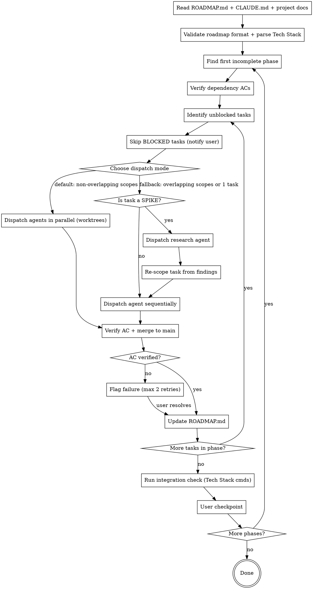

# Execute Roadmap

## Overview

Reads a `ROADMAP.md` (produced by `generate-roadmap`), then builds the project phase-by-phase directly on main. Independent tasks within a phase can run in parallel using git worktrees (merged into main on completion), or sequentially on the working tree. Completed phases are collapsed to save context.

## Reusable Agents

This skill dispatches the following named agents (defined in `agents/`). Address them with `@<name>` rather than inlining ad-hoc Task prompts — the agent files own the prompt contract, and using named agents keeps dispatch consistent across runs and between `execute-roadmap` and `auto-execute-roadmap`.

- `@phase-executor` — implements a single task in the current phase. One per task in parallel mode.
- `@spike-researcher` — read-only investigation for `[SPIKE]` tasks; returns refined scope and approach.
- `@ac-verifier` — runs the Tech Stack Build/Test/Lint (and optional Dev) commands and reports pass/fail. Use for both per-task AC checks and per-phase integration checks when the main session would otherwise burn tool calls running commands itself.
- `@phase-reviewer` — diff-based quality review of a completed phase, invoked between integration check and user checkpoint when `runPhaseReviewer` is enabled.

All four agents live in `${CLAUDE_PLUGIN_ROOT}/agents/`. See those files for the exact input contract each one expects.

## Plugin Options (read at runtime)

Users configure this plugin via `plugin.json` `userConfig`. Claude Code exports chosen values as env vars to this skill's subprocesses:

- `CLAUDE_PLUGIN_OPTION_PARALLELAGENTLIMIT` (number, default `4`) — cap on concurrent `@phase-executor` agents per phase.
- `CLAUDE_PLUGIN_OPTION_DEFAULTEFFORT` (string, default `medium`) — effort level passed to dispatched agents. `xhigh` requires Opus 4.7.
- `CLAUDE_PLUGIN_OPTION_WORKTREEPARENTDIR` (string, default `..`) — parent directory for parallel worktrees.
- `CLAUDE_PLUGIN_OPTION_AUTOCOMMITONACPASS` (boolean, default `true`) — whether the executor auto-commits after AC passes.
- `CLAUDE_PLUGIN_OPTION_RUNPHASEREVIEWER` (boolean, default `true`) — whether to dispatch `@phase-reviewer` between integration check and user checkpoint.

Respect these values when choosing parallelism, effort, and post-phase actions. If env vars are not set, fall back to the documented defaults.

## When to Use

- User says "execute the roadmap", "start building", "work through the phases"
- A `ROADMAP.md` exists in the project root
- User wants to automate multi-phase implementation

## Process



### Step 1 — Read, Validate, and Parse

- Read `ROADMAP.md` from project root. **If it does not exist**, inform the user and suggest running `generate-roadmap` to create one. Do not proceed without a roadmap.
- Read `CLAUDE.md` if it exists — extract coding conventions, tech stack, standards that agents must follow
- Read architecture/design docs referenced in the project
- **Parse Tech Stack section:** Extract the Build, Test, Lint, and Dev commands. These are used for AC verification and integration checks throughout execution.
- **Validate format:** Check that every task has `scope:`, `AC:`, a priority, a size, and a sequential `#ID`. If any are missing, warn the user before proceeding.
- Parse phases, task statuses, dependencies
- Identify the first phase that is not `DONE`

### Step 2 — Identify Unblocked Tasks

Within the current phase, find all tasks where:
- Status is `TODO` (skip `DONE` or `IN PROGRESS`)
- Task is NOT flagged `[BLOCKED: ...]`
- All `depends: #x` references point to tasks marked `DONE` or in a completed phase

**Handle BLOCKED tasks:** If any tasks in the phase have the `[BLOCKED: reason]` flag:
1. List all blocked tasks and their reasons to the user at the start of the phase
2. Ask: "These tasks are blocked — has anything changed?" For each:
   - If the user confirms the blocker is resolved: remove the `[BLOCKED]` flag and include the task in the dispatch queue
   - If still blocked: skip the task entirely — do not dispatch it. Continue with unblocked tasks.
3. If ALL tasks in a phase are blocked, pause and tell the user: "Phase N is entirely blocked. Resolve these blockers or adjust the roadmap before continuing." Do not proceed to the next phase — blocked tasks may be prerequisites for later phases.
4. At the end of a phase, if blocked tasks remain: report them again and ask whether to (a) wait, (b) skip and move on, or (c) re-plan.

Order unblocked tasks within the phase: P0 first, then P1, then P2.

### Step 3 — Handle SPIKE Tasks

If a task has the `[SPIKE]` flag:

1. Dispatch the `@spike-researcher` agent with the task id, description, scope, and any specific open questions that need to be resolved before implementation. The agent file (`agents/spike-researcher.md`) defines the full input contract and output format — don't duplicate those instructions inline.
2. Present the agent's findings to the user.
3. Update the task description, AC, and size in ROADMAP.md based on the findings.
4. Remove the `[SPIKE]` flag and proceed to dispatch the implementation agent.

### Step 4 — Mark In Progress and Dispatch Agent

Before dispatching, mark the task as `IN PROGRESS` in ROADMAP.md and commit. This enables resumability if the session is interrupted.

**Choose dispatch mode** based on the phase:

#### Parallel Mode (default — worktrees)
Multiple agents run simultaneously in isolated git worktrees. **This is the default when conditions are met.** Use when:
- Tasks within the phase have **non-overlapping `scope:` values**
- The phase has 2+ independent tasks

Do NOT ask the user for permission — just dispatch in parallel and inform them: "Dispatching N tasks in parallel (non-overlapping scopes)." If the user has explicitly requested sequential execution, respect that.

#### Sequential Mode (fallback)
One agent at a time on the working tree. Use when:
- Tasks have overlapping scopes (even if in the same phase)
- The phase has only 1 task
- The user has explicitly requested sequential execution

**Parallel workflow:**
1. For each task, dispatch the `@phase-executor` agent with `isolation: "worktree"`. Cap concurrent agents at `CLAUDE_PLUGIN_OPTION_PARALLELAGENTLIMIT` (default 4) — queue any remaining tasks and dispatch them as earlier ones merge.
2. Each agent works in its own copy of the repo — no conflicts possible.
3. As each agent completes, **merge its worktree branch into main immediately** in completion order: `git merge <worktree-branch> --no-ff -m "roadmap #N: <description>"`. Do not wait for all agents to finish — merge as they arrive. Completion order is safe because scopes don't overlap.
4. If a merge conflict occurs (shouldn't with non-overlapping scopes, but possible): resolve it or fall back to sequential for the conflicting task.
5. After merging, **explicitly call `ExitWorktree`** to clean up the worktree directory and branch. Do not rely on automatic cleanup — always call `ExitWorktree` after the merge completes (or if the agent fails and the worktree is no longer needed).

**`@phase-executor` input contract:**

Pass these inputs when dispatching (the agent file `agents/phase-executor.md` documents the full contract):

- **Task**: `#{id}: {description}`
- **Acceptance criteria**: `{AC line from roadmap}`
- **Scope**: `{scope from roadmap}`
- **Tech Stack commands**: Build / Test / Lint (and Dev if present) — verbatim from the `## Tech Stack` section of ROADMAP.md.
- **Project conventions**: key points from CLAUDE.md (tech stack, naming, patterns).
- **Completed dependencies**: `depends:` task ids + one-line description of what each produced.
- **Phase context**: collapsed summaries of prior completed phases (Built / Patterns / Key files).
- **Task type hint**: `infra` | `ui` | `api` | `test` | omit for general. The executor applies type-specific verification steps.
- **Effort**: set to `CLAUDE_PLUGIN_OPTION_DEFAULTEFFORT` (default `medium`, or `xhigh` on Opus 4.7 for large/risky tasks).

For tasks sized `[L]`, also instruct the executor to commit intermediate progress with messages like `roadmap #{id} (wip): {what was completed}`. This preserves progress if the session is interrupted.

**Dispatch rules:**
- Prioritize P0 tasks first within each phase
- Tightly coupled tasks (e.g., a component and its direct wiring) → group into one agent
- In parallel mode, dispatch all independent tasks simultaneously, then merge each as it completes (completion order, not task-ID order)
- In sequential mode, one agent finishes and commits before the next starts

### Step 5 — Verify Acceptance Criteria and Merge

After each agent completes:

1. **Verify AC explicitly** — run each command listed in the task's AC and check the output. You may either run the commands directly from the main session or delegate to the `@ac-verifier` agent (recommended for phases where multiple tasks complete in quick succession — the verifier returns a compact pass/fail report per command, saving tool calls in the main session). If an AC check fails, re-run once to rule out flakiness before flagging as a failure.
2. If AC passes, merge directly into main (for worktree agents: `git merge <worktree-branch> --no-ff`, then call `ExitWorktree` to clean up; for sequential agents: work is already on main). If `CLAUDE_PLUGIN_OPTION_AUTOCOMMITONACPASS` is `false`, leave the executor's staged changes in place for user review instead of merging automatically.
3. **Report progress:** "Task #N done (3/5 in Phase 2). Overall: 12/30 tasks complete."

### Step 6 — Handle Failures

If an agent fails or AC verification fails:
1. Present the failure to the user with context
2. Ask: **retry**, **skip** (defer task), or **intervene manually**?
3. If retry: re-dispatch with additional context about what went wrong. **Max 2 retries per task.** After 2 failed retries, the task is considered blocked — present the failure details and ask the user to either intervene manually or skip.
4. If skip: mark task as `TODO` still, add a note explaining the failure, continue to next task

**Rollback:** If a phase cannot be completed and the user wants to undo:
- Offer to: (a) revert all commits from this phase, (b) keep successful tasks and retry failed ones, or (c) re-plan remaining tasks by invoking `generate-roadmap` on the unfinished portion.

### Step 7 — Update ROADMAP.md

After each task completes successfully:

1. Mark the task as `DONE`:
   ```
   - DONE [P0] [M] #5: Wire columns to IPC list_dir — depends: #2 ✓, #4 ✓ — scope: src/views/
   ```

2. In subsequent phases, mark newly satisfied dependencies with `✓`:
   ```
   - TODO [P0] [M] #7: Quick Look overlay — depends: #5 ✓ — scope: src/overlay/
   ```

3. If ALL tasks in the phase are done, collapse using this structured template — later agents lose access to individual task details, so anything important must survive in the summary:
   ```
   ## Phase N — DONE
   Built: {what was created/implemented}. Patterns: {architectural decisions, conventions established, design patterns chosen}. Key files: {important new/modified files or directories}. (X/X tasks)
   ```
   Example:
   ```
   ## Phase 2 — DONE
   Built: Tauri IPC scaffolding, single column view with virtualization. Patterns: repository pattern for data layer, IPC commands follow request/response naming (list_dir_request → list_dir_response). Key files: src/ipc/, src/views/column.tsx, src/data/repository.ts. (2/2 tasks)
   ```
   **What to include:** Anything a future agent would need to know to build on this phase — naming conventions chosen, API shapes, data flow patterns, important type definitions. **What to omit:** Implementation details that are obvious from reading the code (imports, boilerplate, file structure that matches conventions).

4. Commit the updated `ROADMAP.md` with message: `roadmap: complete phase N`

### Step 8 — Phase Completion: Integration Check and User Checkpoint

After all tasks in a phase are complete:

1. **Integration check:** Dispatch the `@ac-verifier` agent with `check type: phase-integration`, passing the Tech Stack commands. The agent runs Build / Test / Lint / Dev and returns a compact per-command pass/fail report. (Alternatively, run the commands directly from the main session if you prefer a tighter loop.) If integration fails: diagnose the issue, fix it, and commit before proceeding.

2. **Phase review** (optional, default on): If `CLAUDE_PLUGIN_OPTION_RUNPHASEREVIEWER` is `true`, dispatch the `@phase-reviewer` agent with the phase number, the list of task ids completed in this phase, and the diff range (e.g., `HEAD~N..HEAD` covering the phase's commits). Surface any `needs rework` findings to the user in the checkpoint below. Skip this step for small or exploratory phases if the user has disabled it.

3. **User checkpoint:** Pause and ask the user:
   - "Phase N complete (overall: X/Y tasks done). Want to review, test manually, adjust the plan, or continue to Phase N+1?"
   - If milestone phase: emphasize that this is a good point to demo/test

4. Proceed to next phase only after user confirms.

### Step 9 — Next Phase

Return to Step 2 with the next incomplete phase. Repeat until all phases are `DONE`.

## Session Budget Awareness

Large phases can exhaust the conversation context. To manage this:
- If a phase has more than ~8 tasks, after completing each batch of ~5 tasks, commit all ROADMAP.md updates and suggest the user start a fresh session to continue. The resumability logic will pick up where things left off.
- When dispatching agents, keep prompts lean — collapsed phase summaries only, not full histories.
- If you notice the conversation is getting long (many tool calls, large outputs), proactively suggest a session break at the next natural checkpoint (after a task completes).

## Dependency Verification Between Phases

When starting a new phase, before dispatching any tasks:
1. Identify all dependency tasks referenced by `depends:` in this phase
2. Re-run the AC checks for those dependency tasks to confirm they still pass after any subsequent changes
3. If a dependency's AC now fails, fix it before proceeding — later work built on a broken foundation will cascade failures
4. This is especially important after parallel merges, where one task's changes may subtly affect another's behavior

## Resumability

If a session is interrupted mid-phase:
1. On resume, read ROADMAP.md and look for `IN PROGRESS` tasks
2. Check git log for commits referencing those task IDs — if work was committed, mark as `DONE`
3. For tasks marked `IN PROGRESS` with no committed work, reset to `TODO`
4. Ask the user: continue the current phase or restart it?

## Mid-Execution Re-Planning

If during execution you discover that future phases are invalidated (e.g., a task reveals the architecture needs to change, a dependency was wrong, or scope was significantly off):

1. Finish the current task — don't leave work half-done
2. Pause before starting the next task
3. Present the discovery to the user: what changed and which future tasks/phases are affected
4. Offer: (a) continue as-is, (b) re-run `generate-roadmap` on the remaining phases with the new context, or (c) manually adjust specific tasks
5. If re-planning: mark completed phases as DONE, keep them collapsed, and regenerate only the incomplete phases

Do NOT silently work around bad task descriptions. Flag it early — re-planning a few phases is cheaper than building on a bad foundation.

## Checkpoint Commits

Commit ROADMAP.md at these moments to ensure recoverability:
- **Task start:** After marking a task `IN PROGRESS`
- **Task end:** After marking a task `DONE`
- **Phase end:** After collapsing the completed phase

These commits create a reliable audit trail. If a session dies, the status markers tell the Resumability section exactly where things stopped.

## Agent Context Management

Each dispatched agent receives:
- **Current task(s):** Full description, scope, and AC from roadmap
- **Project conventions:** Key points from CLAUDE.md (tech stack, naming, patterns)
- **Completed phases:** One-line collapsed summaries only (NOT full task lists)
- **Relevant doc excerpts:** Only the sections of architecture/design docs relevant to this task
- **Dependency outputs:** Brief description of what the dependency tasks produced

This keeps agent context lean. Do NOT send the entire ROADMAP.md or full doc contents to each agent.

## Roadmap Format Reference

The skill expects `ROADMAP.md` in the format produced by `generate-roadmap`:

```markdown
## Tech Stack
- Language: ...
- Framework: ...

## Phase N — DONE
Summary of completed work (X/X tasks)

## Phase M — MILESTONE: description
- TODO [P0] [M] #id: Task description — depends: #x ✓, #y — scope: path/
  AC: `command` exits 0; expected behavior observed
- IN PROGRESS [P1] [S] #id: Another task — depends: #z ✓ — scope: path/
  AC: `test command` passes
```

## Common Mistakes

- **Sending too much context to agents:** Only send relevant doc sections and collapsed phase summaries, not everything.
- **Not checking AC:** "Looks good" is not verification. Run the actual AC commands and check the output.
- **Skipping the roadmap update:** The collapsed phase summaries are critical for context management in later phases. Always update.
- **Skipping integration checks:** Individual tasks may work in isolation but break together. Always run a build after completing a phase.
- **No progress reporting:** Report to the user after each task completes, including overall progress.
- **Referencing skills in agent prompts:** Dispatched agents don't have access to the Skill tool. Inline all instructions directly in the agent prompt.
- **Auto-continuing after phases:** Always pause at phase boundaries for user checkpoint. Don't silently start the next phase.
- **Skipping SPIKE research:** If a task is flagged `[SPIKE]`, don't jump straight to implementation. Run the research agent first.
- **Parallel dispatch with overlapping scopes:** Never dispatch tasks in parallel if their `scope:` values overlap — this causes merge conflicts. Fall back to sequential.
- **Forgetting to merge worktrees:** After parallel agents complete, merge each worktree branch into main as it completes. Don't leave orphaned worktree branches.
- **Forgetting to call ExitWorktree:** After merging a worktree branch (or after a failed agent), always call `ExitWorktree` to remove the worktree directory and its branch. Skipping this leaves stale worktrees on disk.
- **Losing architectural context in collapsed summaries:** When collapsing a phase, include key decisions and patterns — not just "what was built." Later agents depend on this context.
- **Retrying endlessly:** Max 2 retries per task. After that, the task is blocked and needs human intervention.
- **Hardcoding build commands:** Always use the commands from the `## Tech Stack` section in ROADMAP.md. Don't guess or hardcode tool-specific commands.
- **Not verifying dependencies between phases:** Re-run AC checks for dependency tasks at the start of each new phase. Later changes may have broken earlier work.
- **Exhausting context on large phases:** If a phase has 8+ tasks, suggest a session break after ~5 tasks. Commit ROADMAP.md updates so resumability can pick up.
- **Dispatching BLOCKED tasks:** Never dispatch an agent for a `[BLOCKED]` task. Always notify the user and confirm the blocker is resolved before unblocking. If all tasks in a phase are blocked, do not skip to the next phase — blocked tasks may be dependencies.
- **Vague collapsed phase summaries:** "Built some stuff (3/3 tasks)" tells future agents nothing. Use the structured template: Built/Patterns/Key files. Include naming conventions, API shapes, and architectural decisions that downstream tasks depend on.
