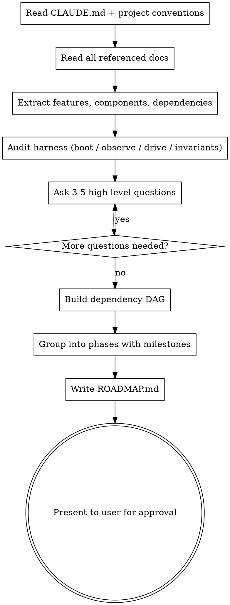

# Generate Roadmap

## Overview

Reads project documents and conventions, asks high-level clarifying questions, then produces a `ROADMAP.md` with dependency-aware phases. Designed to be consumed by the `execute-roadmap` skill.

**Harness first.** Every task is independently validated by an agent that boots the app and drives it (see `docs/harness-engineering.md` in this plugin). A roadmap is only as executable as its harness: if an agent can't boot the app per worktree, observe its state, and reach the states the ACs describe, behavioral ACs can't be validated and tasks can't be marked `DONE`. So this skill audits the harness, writes a `## Harness` section, and schedules any missing capabilities as `[HARNESS]` tasks in Phase 0 before feature work.

## Model Capability Guidance

Dependency-DAG construction is the single highest-leverage step in this skill — a wrong topological order wastes later execution time fixing cascading failures. Spend model capability here:

- **Effort level:** On Opus, use `xhigh` effort for Step 4 (Build Phases). On earlier Opus or Sonnet, `high` effort is appropriate. Default `medium` is acceptable only for trivial roadmaps (≤ 5 tasks).
- **Extended thinking:** Before constructing the DAG, think deeply about task ordering, cross-cutting dependencies, and hidden coupling (shared files, shared state, shared build steps). Surface any assumptions explicitly in the clarifying questions before committing to a phase layout.
- **1M context (Opus 5.5):** You have room to load the **entire** design doc, every referenced architecture/RFC doc, workspace-level CLAUDE.md, project-level CLAUDE.md, and any existing code directories relevant to already-built features — all in one pass. Do this upfront rather than chunking with `@file` references; holistic reading catches dependencies that narrow passes miss. The practical ceiling is ~500k input tokens before inference slowdown, so still skip vendored dependencies, lockfiles, and binary assets.

## When to Use

- User asks to generate a roadmap or project plan
- User provides design docs, architecture docs, or specs and wants them broken into tasks
- User says "break this down" or "plan this project"

## Process



### Step 0 — Check for Existing ROADMAP.md

Before generating anything, check if `ROADMAP.md` already exists at the project root:
- **If it exists:** Ask the user: "A ROADMAP.md already exists. Should I: (a) overwrite it with a fresh plan, (b) extend it with new phases appended after existing ones, or (c) merge — review what's done and regenerate only incomplete phases?"
- If extending or merging, read the existing roadmap first. Preserve all `DONE` phases as collapsed summaries. Reuse existing task IDs and continue numbering from the highest existing ID.
- If overwriting, proceed normally but warn the user that the old roadmap will be replaced.

### Step 1 — Read Project Conventions and All Referenced Docs

Read everything upfront rather than chunking — the model capability guidance section above explains why. Specifically:

- Read workspace-level `CLAUDE.md` (e.g., `~/DEVELOP/CLAUDE.md`) if present — extracts user-level conventions and project inventory.
- Read project-level `CLAUDE.md` — tech stack, coding standards, naming conventions, preferred libraries.
- Read **all** design docs, architecture docs, RFCs, and specs the user referenced, in full.
- Check for existing config files (`package.json`, `Cargo.toml`, `pyproject.toml`, `project.godot`, `tauri.conf.json`, etc.) to detect tech stack.
- Note any conventions that agents must follow during execution.
- Find the existing harness surface: dev/start scripts and whether they accept a port override, health endpoints, headless or sim modes, debug globals, seed or fixture scripts, custom lint rules, and `docs/` architecture maps. Step 2.5 builds on these findings.

### Step 2 — Document Analysis

Read all provided/referenced documents. Extract:
- Feature areas and components
- Technical work items (infra, CI, testing)
- Existing priority signals (P0/P1/P2, "must have", "v1 vs v1.1")
- Dependencies between work items (what must exist before something else can be built)
- External blockers (design assets, API keys, third-party services, manual setup steps)

**Existing codebase:** If code already exists, read key files and directories to understand what's already built. Mark any already-implemented work as `DONE` in the roadmap. The roadmap should build on what exists, not duplicate it.

### Step 2.5 — Harness Audit

Work out how an agent will **boot, observe, drive, and constrain** this project. Fill in each `## Harness` field (see Output Format). For every field you can't fill from existing code, create a `[HARNESS]` task.

| Field | Question | Typical missing-capability task |
|---|---|---|
| **Boot** | Can the app start from any worktree with a port override (`PORT=$PORT`)? | "Make dev server honor `PORT` env (currently pinned to 8080)" |
| **Ready** | Is there a cheap readiness signal? | "Add `GET /healthz` returning 200 once DB is connected" |
| **Driver** | How does an agent exercise it: `browser`, `http`, `headless-sim`, `godot-headless`, `cli`? | "Add `npm run headless -- --scenario <name>` that prints JSON state" |
| **Observe** | Can an agent read app state without judging pixels? | Web/canvas: "Expose `window.__debug.getState()` in dev builds". Server: "Structured JSON logs to stdout". Godot: "Debug autoload that dumps state on `--dump-state`" |
| **Reach** | Can an agent get to deep states quickly and deterministically? | "Deterministic `?seed=` param", "`?scenario=boss-room` URL param", "`db:seed:test` fixture with one user and two orders" |
| **Invariants** | Are the architectural rules mechanically enforced? | "Add `lint:arch` enforcing layer imports (types → … → ui) with remediation text in each error" |

Driver by stack, as a starting point:

- Vite/Three/Babylon/Phaser: `browser` plus `Observe` via a debug bridge. Canvas pixels alone aren't enough.
- Express/Rails APIs: `http`.
- Expo: `browser` against Expo web for UI, `http` for the backend.
- Deterministic sims (shardfall-style): `headless-sim`.
- Godot: `godot-headless`.
- CLIs and libraries: `cli`.

Keep harness tasks small and concrete. Their AC is that **another agent can use the capability without reading its code**, e.g. `probe: with PORT=4811, Boot reaches Ready and window.__debug.getState().scene === "title"`.

### Step 3 — High-Level Questions

Ask 3-5 questions. **Batch the first 3 together**, then follow up only if needed. Skip any already answered by the docs or conversation.

**Question bank (pick the most relevant):**

1. "What does a working MVP look like? I'll optimize the phase order so you get there fastest."
2. "Any features to defer or cut entirely from this roadmap?"
3. "Any tasks not in the docs? (CI/CD, testing infra, design assets, deployment, etc.)"
4. "I've identified these dependencies — anything wrong or missing?" *(present the dependency list)*
5. "Are there any external blockers — design assets, API keys, services, or manual setup needed before certain tasks can start?"
6. "Here's how an agent will boot, observe, and drive the app: {harness summary}. These gaps become Phase 0 harness tasks: {list}. Anything wrong, or any state that's hard to reach that I should know about?"
7. "What architectural rules should be enforced mechanically, e.g. layer boundaries, parse-at-the-boundary, file size limits, structured logging?"

### Step 4 — Build Phases and Generate

Before building the DAG, **think deeply** about task ordering, hidden coupling, and cross-cutting dependencies (shared files, shared migrations, shared type definitions, shared build steps). This is the step where `xhigh` effort on Opus pays off — a clean DAG saves hours of cascading fixes during execution.

1. Build a dependency DAG from the extracted tasks
2. **Prioritize the path to MVP:** Identify the shortest chain of tasks that produces a working end-to-end flow. These tasks are P0 and land in the earliest phases. Everything else supports or extends that path.
3. Topologically sort into phases: tasks with no unmet dependencies go in the earliest possible phase. Let the dependency structure determine the number of tasks per phase — a phase with 2 tasks is fine if that's what the DAG produces. Do not pad phases to hit a target count.
4. Tasks within the same phase are independent and can run sequentially without conflicts
5. **Scope overlap check:** For each phase, verify no two tasks modify the same files or directories. If overlap is detected: (a) merge the tasks into one, (b) add a dependency between them so they land in different phases, or (c) split the overlapping file's concerns into separate scopes. This is critical — overlapping scopes in the same phase cause conflicts during parallel or sequential execution.
6. Mark milestone phases where the project reaches a demo-able state. Every `MILESTONE:` phase gets a `JOURNEY:` line: one end-to-end user flow the validator drives at the milestone checkpoint.
7. **Harness phase:** put every `[HARNESS]` task from Step 2.5 in **Phase 0**, ahead of feature work. A feature task whose `probe:` relies on a harness capability gets `depends:` on that harness task. If the project is greenfield and scaffolding is itself a Phase 1 task, put Boot/Ready/Observe in the scaffold task's AC rather than a separate phase.
8. **Probe coverage check:** every task with behavior a user, client, or player can observe must have at least one `probe:` clause. Execution won't mark such a task `DONE` without a validator `PASS`. Pure `test` tasks and internal `infra` tasks with no observable behavior may have only `cmd:`/`invariant:` clauses.
9. Write `ROADMAP.md` at project root
10. Present to user for review before finalizing

## Output Format

The generated `ROADMAP.md` MUST follow this exact format:

```markdown
# Roadmap

> Phase-based with dependency tracking. Tasks within a phase are independent.
> Statuses: `TODO` | `IN PROGRESS` | `DONE`
> Priorities: `P0` (must have) | `P1` (should have) | `P2` (nice to have)
> Sizes: `[S]` (small) | `[M]` (medium) | `[L]` (large — consider splitting)
> Flags: `[SPIKE]` needs investigation first; `[BLOCKED: reason]` waiting on something external; `[HARNESS]` builds agent tooling (boot/observe/drive/invariants)
> Dependencies: `depends: #x, #y` — all must be complete before task starts
> Scope: `scope: path/` — relevant files/directories for the task (required)
> Acceptance: `AC:` typed clauses, indented below the task. `cmd:` command exits 0 · `probe:` behavior observed by driving the running app · `invariant:` structural rule enforced by a lint
> Milestones: `MILESTONE:` marks demo-able states; `JOURNEY:` is the end-to-end flow validated there
> DONE requires: all `cmd:`/`invariant:` pass, and a validator PASS for every `probe:`. Evidence lives in `.vibecoding/evidence/` (gitignored).
> Completed phases are collapsed to one-line summaries.

## Harness
<!-- How agents build, check, boot, observe, and drive this project. -->
- Language / framework: ...
- Key conventions: ...
- Build: `<build command>`
- Test: `<test command>`
- Lint: `<lint command>`
- Invariants: `<architecture/structure lint command>`   <!-- or "none yet → #0x" -->
- Boot: `<command that starts the app; must honor $PORT>`
- Ready: `<readiness condition, e.g. GET http://localhost:$PORT/healthz → 200>`
- Driver: `browser` | `http` | `headless-sim` | `godot-headless` | `cli`
- Observe: `<how agents read state: window.__debug.getState(), JSON logs, --dump-state, response bodies>`
- Reach: `<how agents reach deep states: ?seed=, ?scenario=, db:seed:test>`

## Phase 0 — Harness
- TODO [P0] [S] [HARNESS] #1: Dev server honors PORT; add /healthz — scope: server/, vite.config.ts
  AC: cmd: build exits 0
      probe: PORT=4811 Boot reaches Ready within 30s; GET /healthz → 200
- TODO [P0] [S] [HARNESS] #2: Dev-only debug bridge exposing game state — scope: src/debug/
  AC: probe: window.__debug.getState() returns { scene, player } on the title screen

## Phase 1
- TODO [P0] [M] #3: Core cart model — scope: src/cart/
  AC: cmd: test passes for src/cart/
      invariant: Invariants clean (cart/ has no ui/ imports)
- TODO [P0] [S] #4: Price formatting utilities — scope: src/utils/
  AC: cmd: test passes for src/utils/

## Phase 2 — MILESTONE: shopper can add items and check out
JOURNEY: open store → add 2 items → cart badge "2" → checkout → order confirmation shows both items; no console errors
- TODO [P0] [L] #5: Cart UI — depends: #2, #3 — scope: src/views/cart/
  AC: cmd: build exits 0
      probe: add 2 items → badge shows "2" and getState().cart.items.length === 2; no console errors
- TODO [P1] [M] #6: Orders endpoint — depends: #1, #4 — scope: server/orders/
  AC: cmd: test passes for server/orders/
      probe: POST /orders with valid cart → 201 + order id; with empty cart → 400 with error message

## Phase 3
- TODO [P0] [SPIKE] [M] #7: Investigate auth approach — scope: docs/
  AC: cmd: decision documented in docs/decisions/; proof-of-concept compiles
```

**Format rules:**
- Each task: `- STATUS [PRIORITY] [SIZE] [FLAGS] #ID: Description — scope: path/` with optional `— depends: #x, #y`.
- `scope:` is **required** on every task. It points agents to the relevant files and saves them significant exploration time.
- Each task has an `AC:` block of **typed clauses**, one per line, indented to align:
  - `cmd:` — a deterministic check run by `@ac-verifier`. Refer to Harness commands by name ("test passes for src/cart/", "build exits 0") rather than hardcoding tool commands.
  - `probe:` — an observable behavior run by `@validator` against the booted app. Write it as **action → observable result**, naming what to observe (DOM text, `getState()` field, status code, log line, CLI stdout). "Works correctly" isn't a probe. "POST /orders with empty cart → 400" is.
  - `invariant:` — a structural rule enforced by the Invariants lint. Encode taste as invariants rather than describing implementations: "parse inputs at the boundary", not "use Zod".
  - Every clause must be checkable by a command or by driving the app. If it can't be, rephrase it or add the `[HARNESS]` task that makes it checkable.
- **Probe coverage:** any task with user-, client-, or player-observable behavior needs at least one `probe:`. Execution won't mark it `DONE` without a validator `PASS`.
- `[HARNESS]` marks a task that builds agent tooling. Harness tasks go in Phase 0, or are inserted mid-execution when the validator reports a missing capability. Their AC proves another agent can use the capability.
- `[SPIKE]` marks a task that needs investigation before implementation. A research-only agent runs first, then the task is re-scoped from its findings.
- `[BLOCKED: reason]` marks a task waiting on something external (design assets, API keys, third-party setup, manual configuration). Blocked tasks are skipped during execution until resolved. Say what's needed and who can unblock it.
- Sizes: `[S]` (small, a few hours), `[M]` (medium, a day), `[L]` (large, multi-day — consider splitting).
- Task IDs are sequential integers starting at #1. Phase 0 tasks take the lowest IDs.
- **Prioritize the path to MVP:** P0 = on the critical path to a working end-to-end flow, or blocks other tasks. P1 = important but off the critical path. P2 = enhancement or nice-to-have. When in doubt, ask: "does the MVP work without this?" If yes, it's not P0. Harness tasks that P0 probes depend on are P0.
- Phases are ordered by dependency (phase N has no deps on phase N+1 or later).
- All tasks within a phase are independent of each other.
- Let the dependency DAG determine phase sizes. Don't pad phases to hit a count. A phase with 2 tasks is fine. Small projects may have 10 total tasks, large ones 80+.
- Dependencies reference task IDs, not phase numbers.
- Add `MILESTONE:` to phase headers where the project reaches a demo-able or testable state, followed by a `JOURNEY:` line. **User checkpoints happen only at milestones**, so place them where a human review is actually worth it. Aim for one every 2–4 phases.
- Tests are part of each task's `cmd:` ACs, not separate tasks. Testing infrastructure (test runner, CI) is an explicit early task if it doesn't exist.
- The `## Harness` section is required. Legacy roadmaps with `## Tech Stack` are still read, but new roadmaps use `## Harness`.

## Completed Phase Format

When phases are marked done (by execute-roadmap or manually):

```markdown
## Phase 1 — DONE
Brief summary of what was built (N/N tasks)
```

This collapses completed work to one line, saving context for the orchestrator.

## Task Boundaries

A good task produces a **testable increment** — it adds something you can verify works in isolation. Ask: "can an agent implement this, run a command, and confirm it works without touching anything else?" If yes, it's the right size. If the task requires coordinating changes across unrelated subsystems, split it. If verifying it requires another task to be done first, add that dependency explicitly.

A task is only verifiable if the harness can observe its result. When writing a `probe:`, check that the Harness `Observe` and `Reach` fields cover it. If they don't, the task depends on a `[HARNESS]` task, or the task itself extends the observe hook within its scope (say so in the description).

## Common Mistakes

- **Too granular:** "Create file X" is too small. "Implement column view with virtualization" is right.
- **Too coarse:** "Build the frontend" is too big. Break into component-level chunks.
- **Missing infra tasks:** Don't forget project scaffolding, CI, testing setup, build config.
- **Circular dependencies:** If A depends on B and B depends on A, they must be in the same task or one dependency is wrong.
- **Independent tasks in different phases:** If two tasks have no dependency relationship, they belong in the same phase.
- **No re-planning escape hatch:** If `execute-roadmap` discovers a task is mis-scoped or dependencies are wrong, it should pause and regenerate affected phases. Design tasks to be independently verifiable so this is rare.
- **Missing scope:** Every task should have a `scope:` hint. Without it, agents waste time exploring the codebase.
- **Non-verifiable AC:** "Code is clean" or "well-structured" can't be checked by a command. Use "builds without errors", "tests pass", "endpoint returns 200" instead.
- **Overlapping scopes in same phase:** If two tasks in the same phase modify the same files, they'll conflict when run sequentially. Either merge them into one task or add a dependency so they're in different phases.
- **Missing external blockers:** Tasks that need design assets, API keys, third-party services, or manual setup should be flagged `[BLOCKED: reason]`. Without this, agents will fail silently when they hit the missing dependency.
- **Untyped or behavior-free AC:** `AC: tests pass` on a UI task means nothing gets validated by driving the app. Add a `probe:` that names an action and an observable result.
- **Pixel-only probes:** "the sprite looks right" for canvas games can't be judged reliably. Probe a `getState()` field and keep screenshots as supporting evidence.
- **Skipping the harness audit:** a roadmap with no Boot/Ready/Observe gets validator `CANNOT_VALIDATE` on every task and stalls. Schedule the harness in Phase 0.
- **Prescribing implementation in invariants:** "use Zod" is micromanagement. "Parse external data at the boundary" is an invariant.
- **Milestones without a JOURNEY:** the milestone checkpoint is the only time a human looks. Give the validator one end-to-end flow to drive and record.
- **Padding phases to a target count:** Let the dependency DAG drive phase structure. Don't group unrelated tasks just to fill a phase, and don't split naturally related work across phases just because a phase feels too big.
